# Chapter 10：System-Level I/O

## 10.1 Unix I/O

所有I/O设备模型化为文件。

**标准输入(描述符0)、标准输出(描述符1)、标准错误(描述符2)**

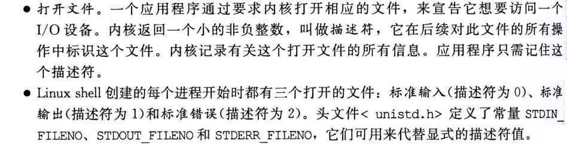

## 10.2 Files

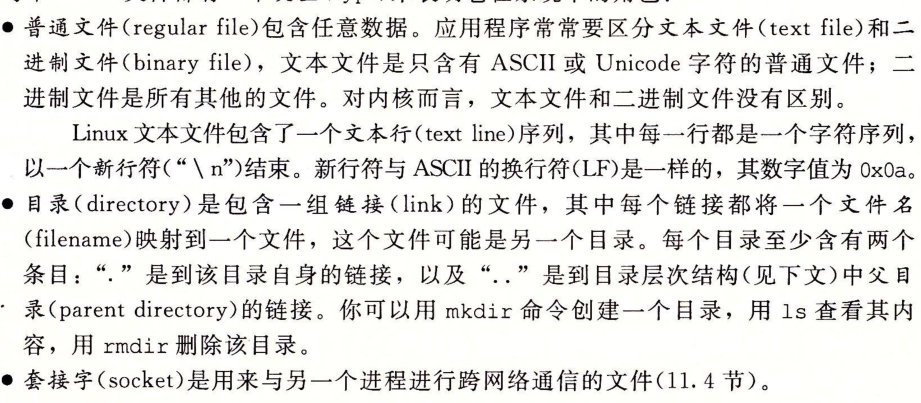

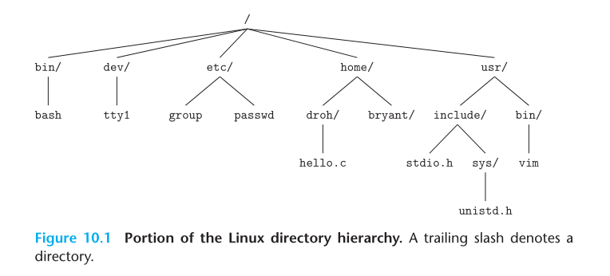

## 10.3 Opening and Closing Files

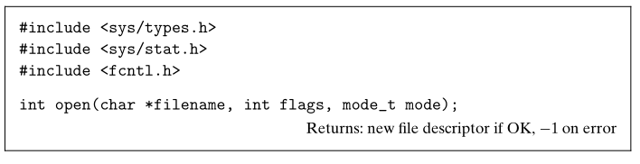

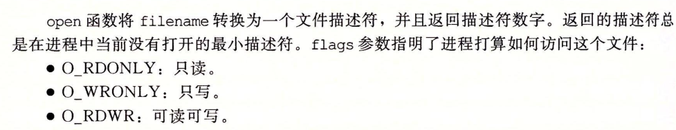

打开的文件描述符是在**进程没有打开的最小描述符**

mode参数：新文件访问权限位

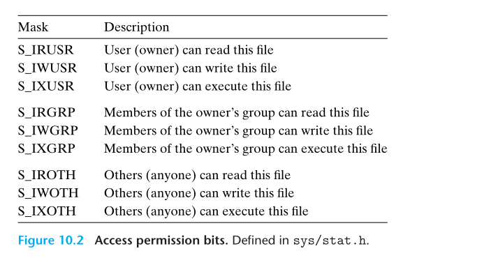

关闭文件

## 10.4 Reading and Writing Files

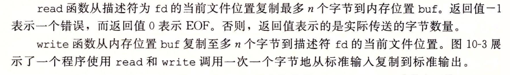

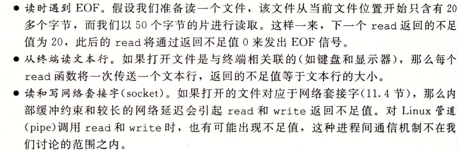

在上面的情况，read 和write传送的字节比应用程序要求的要少

## 10.5 Robust Reading and Writing with RIO Package

无缓冲输入输出函数：内存和文件直接传输

带缓冲输入函数：高效读取，文件内容缓存在应用级缓冲区中。线程安全

### 10.5.1 RIO Unbuffered Input and Output Function

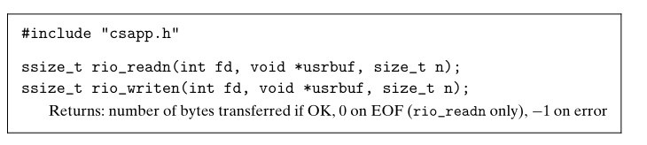

### 10.5.2 RIO Buffered Input Functions

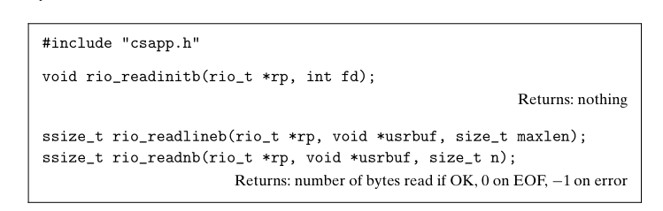

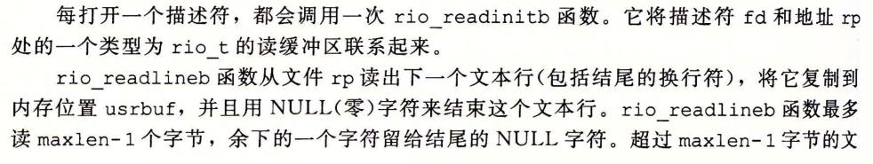

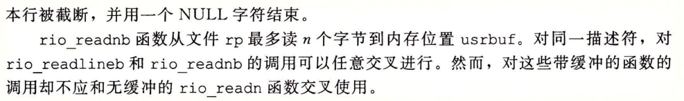

## 10.6 Reading File Metadata

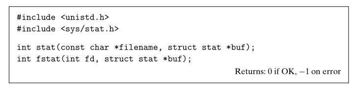

stat以文件名作为输入，填写stat数据结构中各个成员

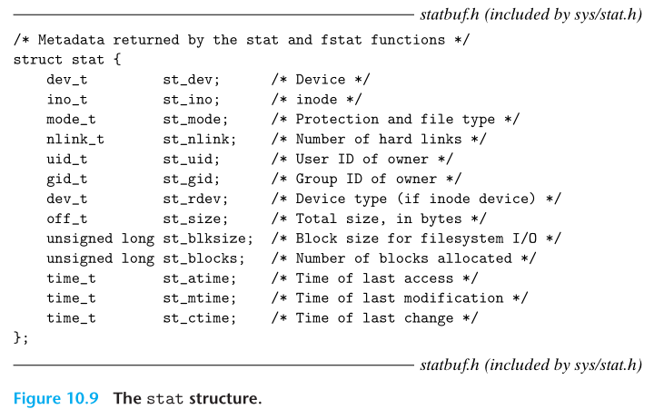

st_size：文件字节数大小

st_mode：编码文件访问许可位

## 10.7 Reading Directory Contents

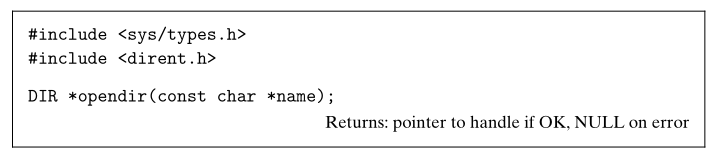

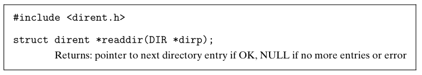

返回指向流dirp下个目录项的指针

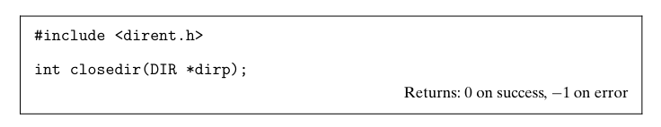

## 10.8 Sharing Files

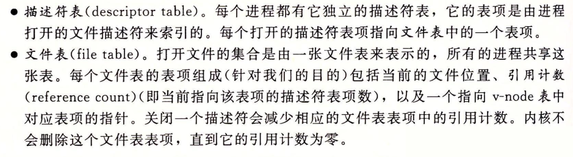

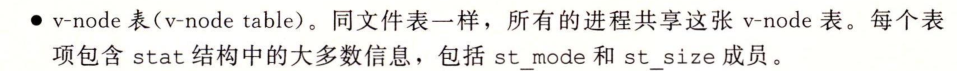

典型结构

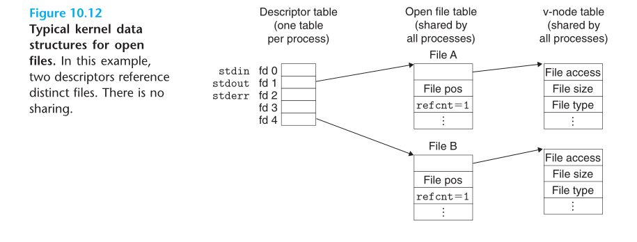

文件共享

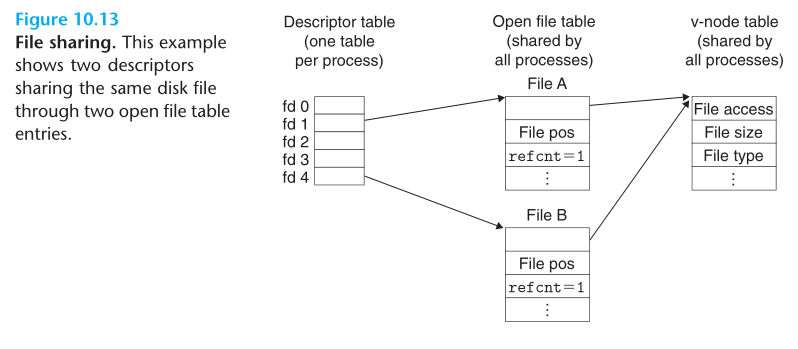

fork创建子进程

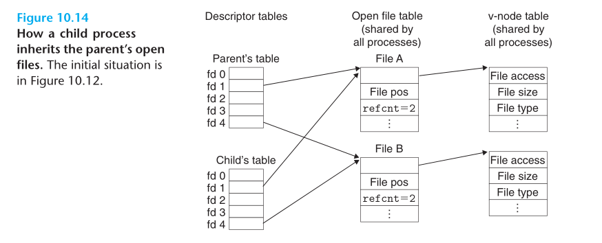

##### 练习题10.2

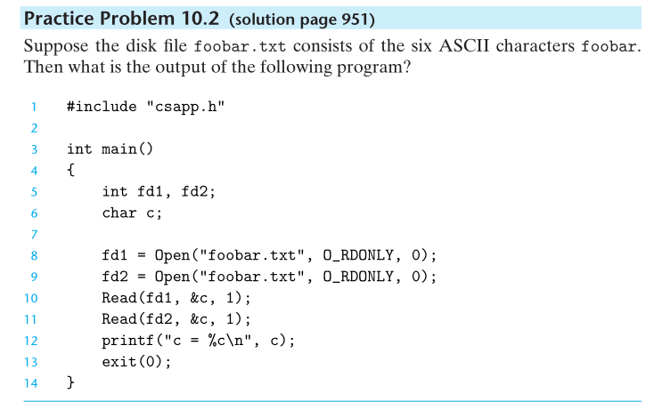

由于fd1、fd2分别打开占用不同的文件描述符，所以fd1读到缓存为f，fd2读到缓存也为f

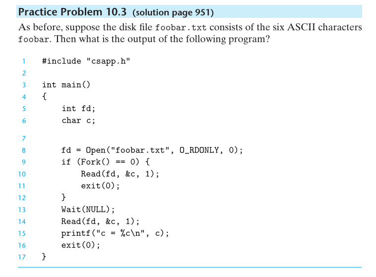

通过fork得到的是副本，复制相同的文件描述符，所以子进程对fd调用Read得到f，子进程释放后，父进程对fd调用Read得到o

## 10.9 I/O Redirection

`ls > foo.txt`

将标准输出重定向到磁盘文件foo.txt

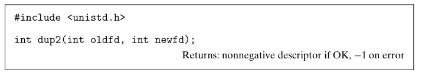

复制描述符表项oldfd到描述符表项newfd，覆盖以前的内容(复制前关闭已打卡的newfd)。

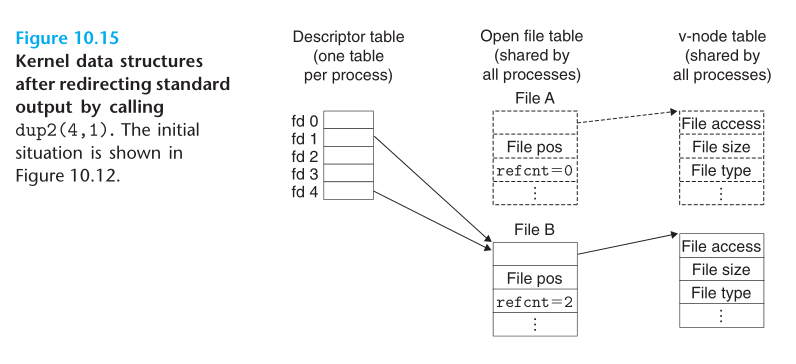

调用dup2(4,1)。将描述符4的内容覆盖描述符1的内容，即让描述符1指向FileB，FileA关闭，文件表和v-node删除，文件B计数增加，**写进标准输出的数据都被重定向到文件B**

## 10.10 Standard I/O

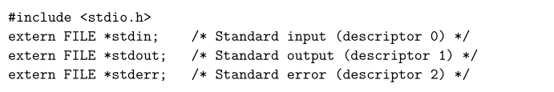

FILE的流是对文件描述符和流缓冲区的抽象。让LinuxI/O系统调用次数尽可能少

## 10.11 Putting It Together :Which I/O Functions Should I Use？

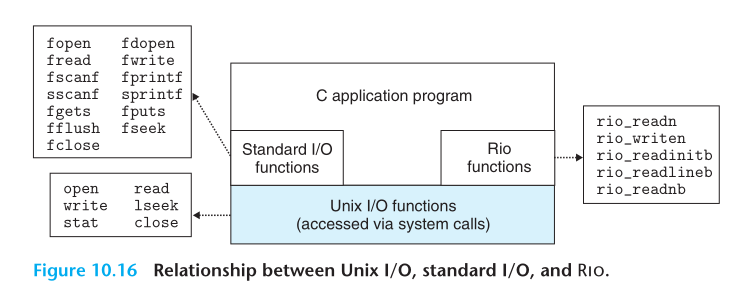

RIO和标准I/O基于Unix I/O函数实现

G1：只要有可能就使用标准I/O

G2：不要使用scanf或rio_readlineb读二进制文件。用来读文本文件

G3：队网络套接字使用RIO函数

标准I/O流，全双工，有时会相互冲突

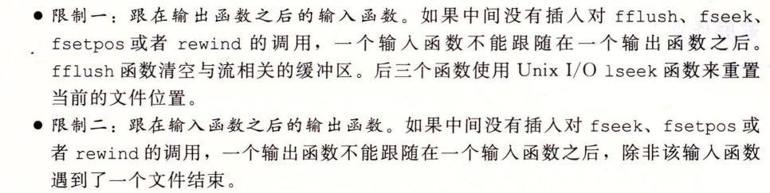

> fflush：刷新缓冲区

第一个限制通过刷新缓冲区解决

要解决第二个限制，需要同个套接字打开两个流

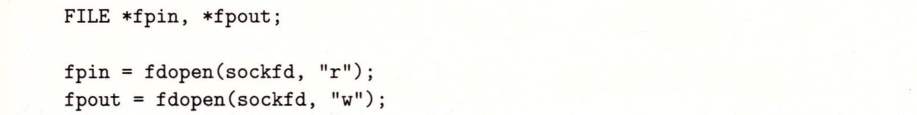

避免内存泄露，需要都释放。

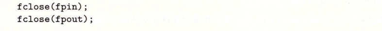

试图关闭同一个底层的套接字描述符，第二个close会失败，线程化程序会导致灾难

**因此建议网络套接字不要用标准I/O函数**

## 10.12 Summary

Linux读写操作会出现不足值，不应直接调用Unix I/O 用RIO包

三个数据结构：描述符表->文件表->v-node表

标准I/O库基于Unix I/O实现。不适合网络应用程序。

