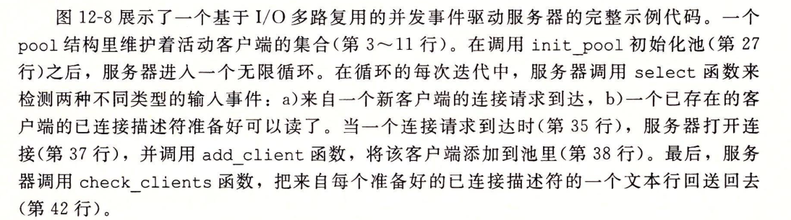
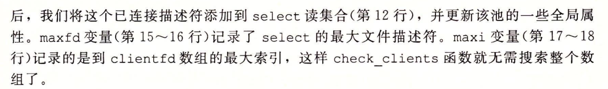
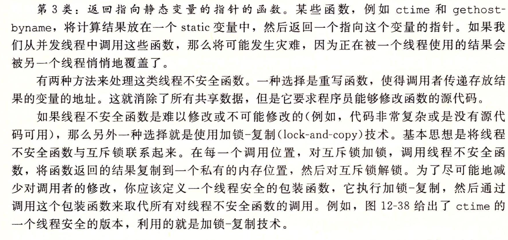
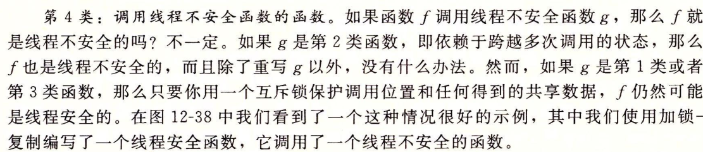
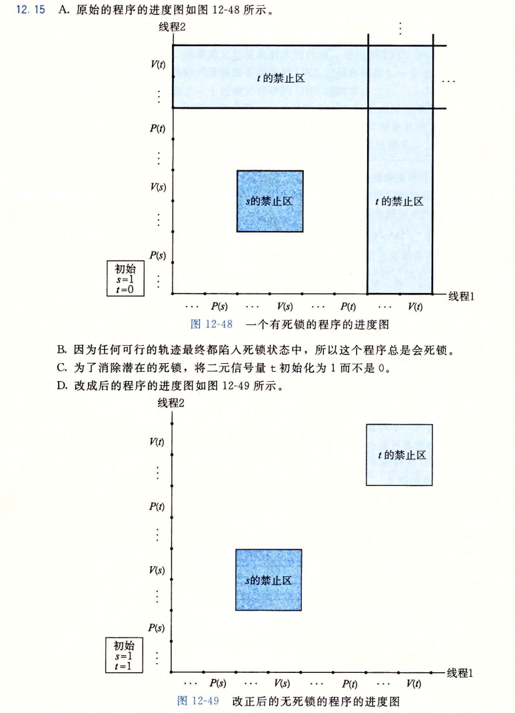

# Chapter 12 Concurrent Programming

## 12.1 Concurrent Programming with Processes

派生子进程进行服务，同时父进程释放已连接描述符，否则会发生内存泄露。子进程并发向各自客户端提供服务

### 12.1.1 A Concurrent Serve Based on Processes

共享文件表，但不共享用户地址空间。

引用计算从2减少到1，仍可以使用

终止时，内核关闭所有打开的描述符

### 12.2 Concurrent Programming with I/O Multiplexing

使用select函数，要求内核挂起进程，只有一个或多个I/O事件发生后，才将控制返回给应用程序。

处理类型为fd_set集合

### 12.2.1 A Concurrent Event-Driven Server Based on I/O Multiplexing

即可作为输入也可作为输出，所以每次调用重新初始化。

## 12.3 Concurrent Programming with Threads

### 12.3.2 Posix Threads

主线程创建对等线程，等待它终止

### 12.3.3 Creating Threads

### 12.3.4 Terminating Threads

### 12.3.5 Reaping Terminated Threads

等待指定而不是任意1

### 13.3.6 Detaching Threads 

### 12.3.7  Initializing Threads

### 12.3.8 A Concurrent Server Based on Threads

多个线程运行在同一个进程中，共享同一个描述符表，引用数为1，只需要关闭一次即可。

## 12.4 Shared Variables in Threaded Programs

### 12.4.1 Threads Memory Model

有自己独立的线程上下文：线程ID、栈、栈指针、程序计数器、条件码和通用目的寄存器值。

### 12.4.2 Mapping Variables to Memory

栈变量线程私有，全局和静态变量是共享的。

* prt：全局变量，能被主程序写和对等线程读
* cnt：静态变量，内存中只有一个实例，被两个对等线程读写
* i.m：主线程栈本地自动变量，对等线程不会在栈中引用它，不是共享的
* msgs.m：主线程栈自动变量，通过ptr间接引用
* myid.0和，yid.1：分别驻留对等线程0和1的栈中

这里ptr、cnt和msgs被对于一个线程引用，是共享的

## 12.5 Synchronizing Threads with Semaphores

中间操作了共享变量cnt，会受到多个线程影响

无法预测按照正确的指令顺序运行

### 12.5.1 Process Graphs

穿过不安全区，是不安全的，经过轨迹或者绕开则安全。

### 12.5.2 Semaphores

### 12.5.3 Using Semaphores for Mutual Exclusion

通过PV操作的结合，创建了禁止区(-1部分)，正好包含了不安全区，所以没有一条轨迹能够进入不安全区，每次运行均能得到正确结果

### 12.5.4 Using Semaphores to Schedule Shared Resources

#### 1.生产者-消费者问题

#### 2.读者-写者问题

一组并发线程访问一个共享对象

写者独占，读者可无限个

1. 读者优先：读者不断进来可能导致饥饿问题
2. 写者优先

mutex用于读者计数，w用于控制写者是否能进行操作。

### 12.5.5 Putting It Together : A Concureent Server Based on Prethreading

从缓冲区中取出已连接描述符，让工作者线程进行操作。

## 12.7 Other Concurrency Issues

### 12.7.1 Thread Safety

### 12.7.2 Reentrancy

当被多个线程调用，不会引用任何共享数据。

### 12.7.3 Using Existing Library Functions in Threaded Programs

### 12.7.4 Races

在创建线程时引入参数，参数i在进行i++执行前后导致局部变量myid复制的线程id可能得到不正确的线程ID，

为每个整数ID分配独立的块，传递给线程指向这个块的指针

### 12.7.5 Deadlocks

每个线程先对s枷锁，然后对t加锁

练习题12.15

