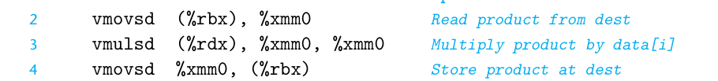
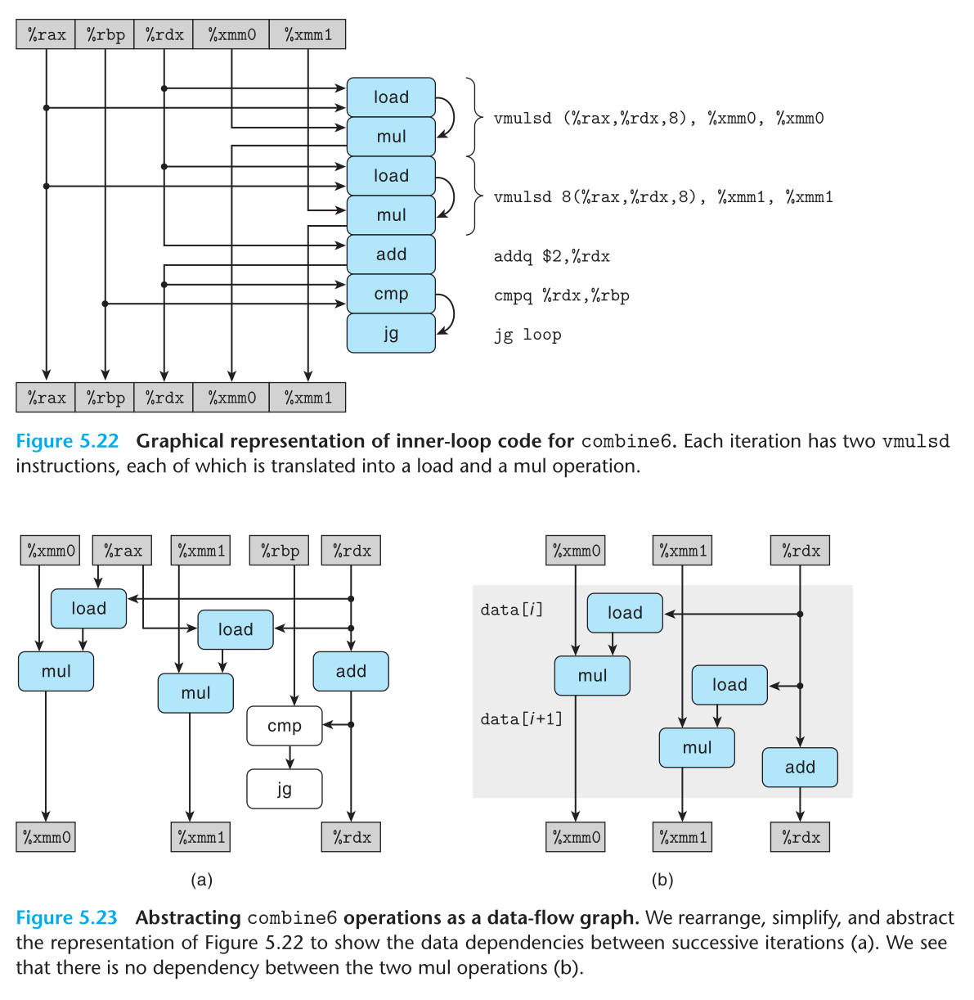

# Chapter 5: Optimizing Program Performance

## 5.1 Capabilities and Limitations of Optimzing Compilers

GCC优化级别，主要考虑以-O1

twiddle2效率更高（读xp，读yp，写xp），3次引用

twiddle1需要6次引用(各两次)

若**考虑xp等于yp**，则得到结果不同，不能考虑将其优化为twiddle2

若不能确定p跟q指针位置是否相同，则无法确定结果，限制了优化策略。

第二个妨碍因素是**函数调用**

若函数修改了全局变量，则每次调用的返回值都会不同。编译器假设最糟情况，保持函数调用不变

**可以用内联函数替换优化函数调用**

## 5.2 Expressing Program Performance

CPE（**每个元素**周期数，而不是每次循环）

前置和函数，函数1每次迭代计算一个元素，函数2计算2个元素。

通过最小二乘拟合，psum2的CEP为6.0，优于CPE为9.0的psum1

## 5.3 Program Example

结构

定义

代码计算

结果

得出结论，使用-O1比直接翻译的C语言代码效率高很多

## 5.4 Eliminating Loop Inefficiencies

**案例1**

由于循环中的长度计算不会受循环影响，所以可以单独计算，用length赋值为局部变量，再放入循环，成为**代码移动(code motion)**

识别执行多次，但计算结果不会改变的计算

**案例2**

函数lower1耗时指数级增长，而lower2值调用1次，性能很好

## 5.5 Reducing Procedure Calls

结果并没有提高性能，5.11.2节会再解释，反复边界检查不会让性能更差。

## 5.6 Eliminating Unneeded Memory References

由于每次迭代，累积变量数值都从内存读出再写入内存。

可以引入临时变量，把两次读，一次写操作，减少到一次读(读出后直接存在寄存器，不用读完马上写入内存)

得到显著提升

假设内存别名使用，函数行为可能不同，

v=[2,3,5]

保守的方法是编译combine3，不断进行读写内存，即使效率不高。

##### 练习题5.4

没有优化，寄存器%xmm0被用作临时值，每次循环迭代都会设置和使用。

优化版本，像是遍历，累积向量元素乘积。如下版本C代码

两个版本功能相同，在内存别名的使用中也相同。

因为每次迭代从dest读出的值和前一次迭代最后写入到寄存器的值是相同的，所以功能相同。

## 5.7 Understanding Modern Processors

延迟界限：下一条指令开始之前，这条指令必须结束

吞吐量界限：处理器功能单元的原始计算能力。

### 5.7.1 Overall Operation

超标量(superscalar)：每个时钟多个操作

乱序(out-of-order)：执行跟机器级程序顺序不一定一致

指令控制单元(ICU)：从内存中读出指令序列，生成一组针对程序数据的操作

执行单元(EU)：执行操作，指出预测是否正确

指令高速缓存包含最近访问的指令，ICU会再当前正在执行的指令很早前取指，才有足够时间对指令译码，操作发送到EU

包含一个或多个内存引用的指令，译码成三个操作

1. 从内存加载值到处理器
2. 将在家进来的值加上寄存器的值
3. 结果存回内存。

后续的微处理器都增加了功能单元的数量以及每个单元能执行的操作组合

retirement unit(退役单元)记录正在进行的处理，确保遵守语序语义(寄存器文件是一部分)，如果预测正确，指令退役(retired)，否则指令清空(flushed)

只有指令退役了，寄存器才会更新

register renaming(寄存器重命名)：条目(r,t)指每个程序寄存器r与更新该寄存器操作标记t关联。结果(v,t)指标记t的操作产生值v

### 5.7.2 Functional Unit Performance

延迟：完成运算所需总时间

发射时间：两个连续的同类型运算之需要最小周期数

容量：能执行该运算的功能单元数量

发射时间1：完全流水线化(fully pipelined)。

容量大于1：多个功能单元

4个功能单元可以执行整数加法，但只有2个加载单元，所以每个时钟周期最多只能读取两个数据值

### 5.7.3 An Abstract Model of Processor Operation

函数性能由所执行的求和或者乘积计算主宰的

#### From Machine-Level Code to Data-Flow Graphs

只读：作为源值，不被修改

只写：为数据传送目的

局部：循环内部被使用和修改(案例中条件码寄存器)

循环：即可作为源值又作为目的，一次迭代产生另一次迭代使用。

更清晰的数据流图

cmp和jne不直接影响数据流，不属于某个循环寄存器之间的相关联，标记白色。

右图表示一次迭代形成的数据相关图

n次迭代结果，浮点乘法延迟5周期，加法1周期，浮点乘法为关键，总共5n个周期执行

#### Other Performance Factors

整数加法combine4表明CPE为1.27，而不是预测的1.00，表明数据流表示中的关键路径只是提供程序需要周期数下界，还有其他因素限制。

## 5.8 Loop Unrolling

2X1展开循环，每次迭代处理2条数据，处理完成i+=2。

同样可以扩展到K X 1循环模式

消除循环开销，降低开销操作的数量。

只改变加法的CPE，但不能超过延迟界限

虽然循环展开了2次，但关键路径上还是有n个mul操作

很多编译器都能做好循环展开。

## 5.9 Enhancing Parallelism

### 5.9.1 Multiple Accumulators

打破了延迟界限的限制

因为采用了不同寄存器存储变量。

形成了两条并行的关键路径

由于浮点乘法和加法不可结合，因此，四舍五入或者溢出会导致产生不同结果，需要去权衡性能翻倍和结果不同的重要性。

### 5.9.2 Reassociation Transformation

改变了合并顺序，称为"2X1a"循环展开形式

结果除了加法，其他的性能都发生了加倍

**每次迭代第一个乘法不需要等待前一次迭代的累计值**就可以执行，，最小可能CPE减少2倍

关键路径只有n/2个操作

k X 1a性能跟k X k循环展开结果相似

整数可结合，但浮点数需要评估是否会造成严重影响。大多数这种差别不重要。

大多数编译器不会尝试对浮点运算进行重新结合

> 关键路径：这次迭代用到了上次迭代的数据。

## 5.11 Some Limiting Factors

### 5.11.1 Rgister Spilling

超过寄存器数量，就会存入内存，增加延迟，如k=20

需要先从内存取出，放入寄存器，计算，最后再写回内存

### 5.11.2 Branch Prediction and Misprediction Penalties

#### Do Not Be Overly Concerned about Predictable Branches

边界检测的额外计算可以与合并操作并行执行，影响不大。

#### Write Code Suitable for Implementation with Conditional Moves

命令式风格

功能式风格

从条件控制转移变为条件数据传送形式，CPE从13.5降低到4.0。

##### 练习题5.9

## 5.12 Understanding Memory Performance

### 5.12.1 Load Performance

依赖加载单元延迟，两个加载单元而言，每个时钟只能启动一个加载操作，所以CPE不可能小于0.5

从汇编代码看出，第3行，寄存器%rdi的每个值都依赖加载操作的结果，加载操作又以%rdi中的值作为地址。所以上一次迭代完成，下一次迭代的加载操作才能开始。CPE=4.00

### 5.12.2 Store Performance

Example A src读出的结果不受dest写影响，CPE=1.3

Example B 读/写相关，CPE=7.3

第一个操作，翻译成两个操作：

* s_addr指令计算存储操作的地址，在存储缓冲区创建一个条目，并设置该条目的地址字段
* s_data操作设置该条目的数据字段。

s_data和load虚弧线，如果两个地址相同，load必须等待直到s_data把结果放到存储缓冲区中。

标识1：存储地址必须在数据呗存储之前计算出来

标识2：需要load操作将它的地址与之前未完成的存储操作地址进行比较

标识3：条件数据相关，当加载和存储地址相同会出现

示例A：不同源和目的地址，独立进行，关键路径是减少变量cnt形成

示例B：源地址目的地址相同，数据相关形成存储、加载和增加数据，一共7个时钟周期。

## 5.13 Life in the Real World: Performance Improvement Techniques

1. 选择适当算法和数据结构
2. 消除连续函数调用(放循环外)、消除不必要的内存引用
3. 结合硬件：展开循环，累积变量和重新结合等技术，功能性风格重写条件操作

## 5.14 Identifying and Eliminating Performance Bottlenecks(确认和消除性能瓶颈)

### 5.14.1 Program Profiling(程序剖析)

确定程序各部分需要多少时间

Unix系统提供GPROF

将注意力集中在最耗时的部分很重要