# Chapter 6：The Memory Hierarchy

## 6.1 Storage Technologies

### 6.1.1 Random Access Memory

#### Static RAM

快、贵、高速缓存

双稳态，只要有电，永远保持值。抗干扰

#### dynamic RAM

主存、缓冲区

干扰敏感，扰乱不会恢复

摄像机中传感器本质上就是DRAM单元的阵列

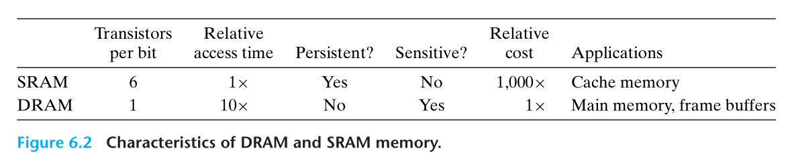

#### Conventional DRAMS

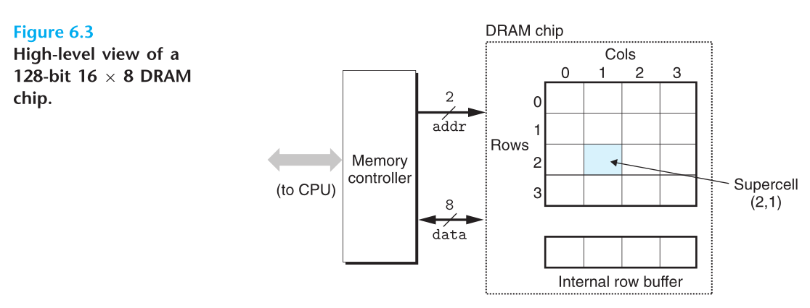

16X8的DRAM芯片

d=16、w=8、r=4、c=4

8个data引脚，2个addr引脚

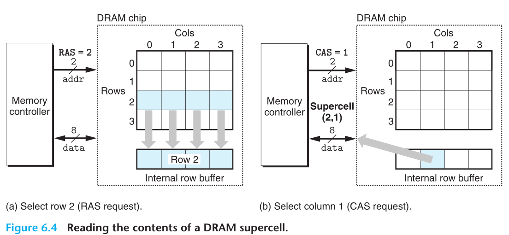

内存控制器(memory controller)先输入RAS=2，将第二行存入内存缓冲区，再通过CAS=1找到对应的8位信息。

**二维阵列可以减少地址引脚的数目**

#### Memory Modules

8个8MX8的DRAM，存储64MB数据，(i,j)取出64位字，DRAM0存储第一个字节，以此类推。最后合并成64位字，返回给内存控制器

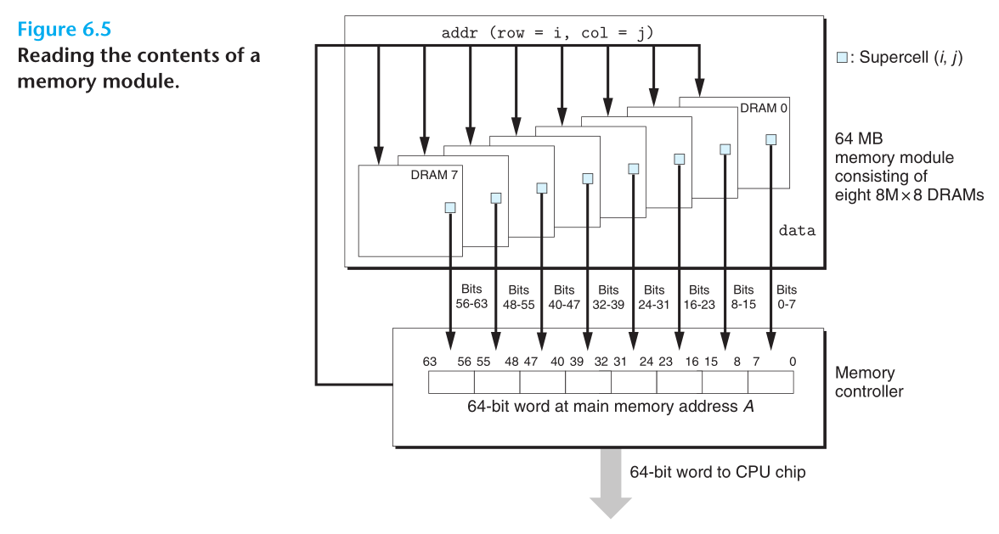

#### Enhanced DRAMs

Fast Page Mode DRAM：允许对同一行连续访问。

Extended Data Out DRAM：FPM增强，允许CAS信号时间更紧密

Synchronous DRAM：FPM和EDO都是异步的，同步能更快输出内容

Double Data-Rate DRAM(DDR)：两个时钟沿作为控制信号，速度翻倍。DDR（2 bits）、DDR2(4 bits)、DDR3(8 bits)

Video RAM：用于图形系统的帧缓冲区

#### Nonvolatile Memory

断点后仍保存信息。

Read-Only Memory ROM：只读

Programmable ROM：只能被编程一次。

Erasable Programmable ROM：紫外线光照清除，大概1000次

Electrically Erasable PROM：电路卡上编程，10的5次方

flash memory：基于EEPROM

Solid State Disk, SSD：比传统磁盘更快速

#### Accessing Main Memory

bus：总线

bus transaction：CPU和主存数据传输

read transaction：主存传输数据到CPU

write transaction：CPU传数据到主存

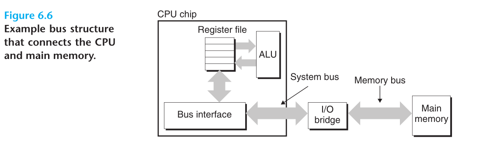

`movq %rax A`

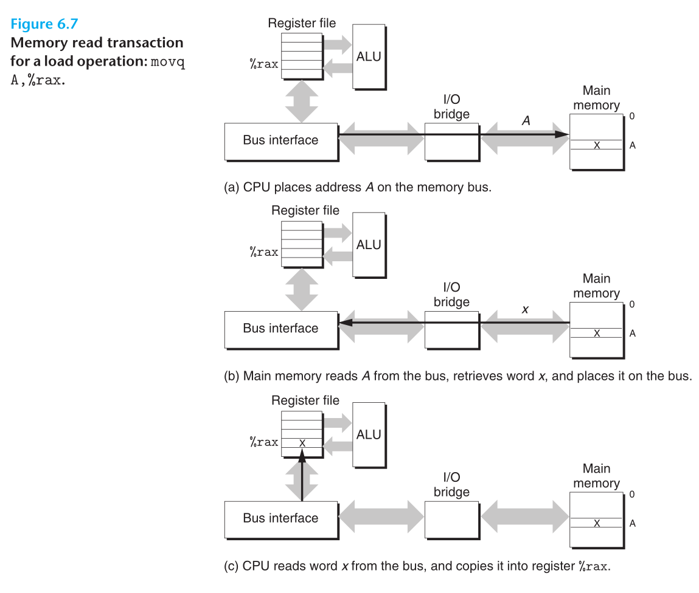

发起读事务，CPU将地址A放到系统总线，I/O桥将信号存到内存总线，内存总线将地址A传给主存，主存读出数据，写到内存总线，翻译给系统总线，传给总线接口(bus Interface)，最后将数据存入寄存器中。

`movq %rax, A`

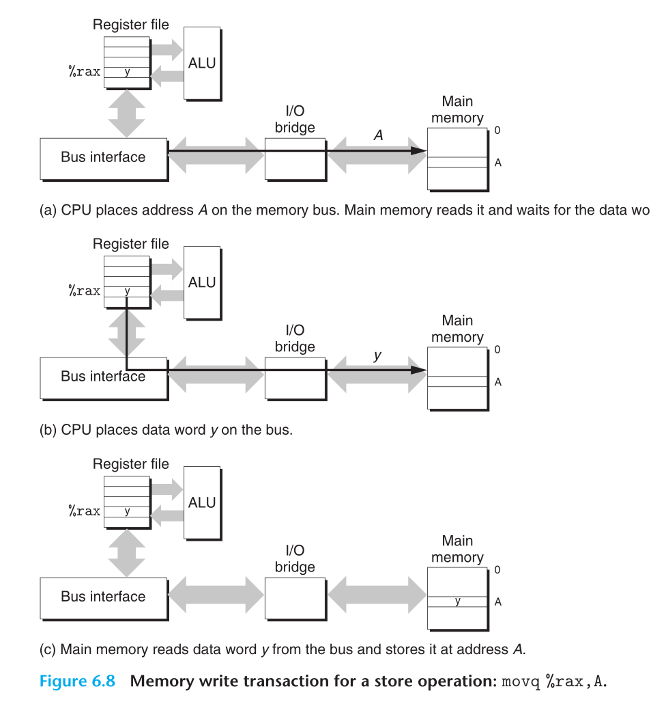

写事务三个步骤

### 6.1.2 Disk Storage

#### Disk Geometry

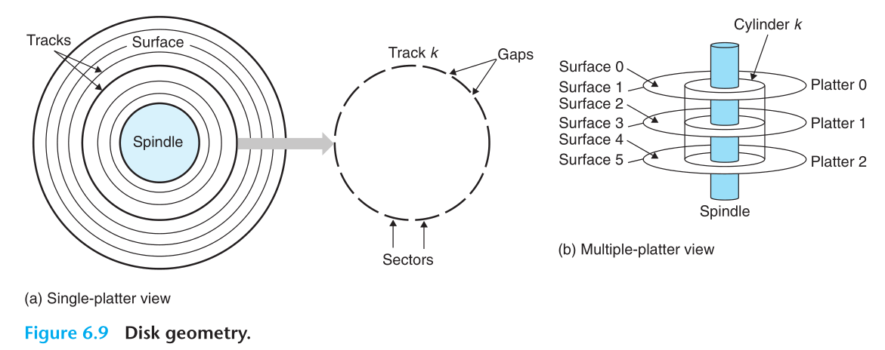

gap：存储标识扇区的格式化位，不存数据位

#### Disk Capacity

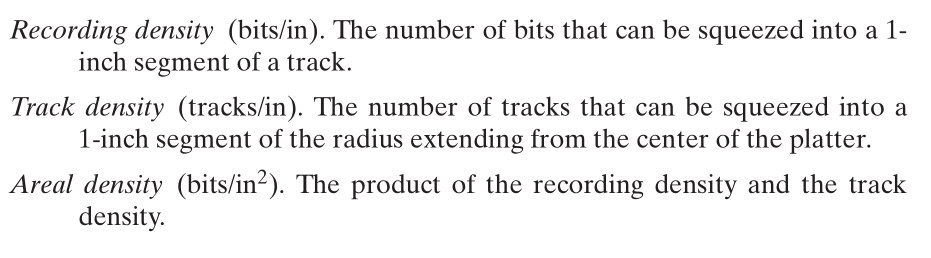

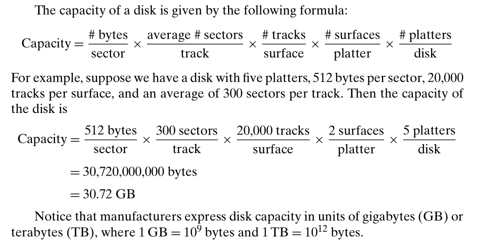

#### Disk Operation

寻道

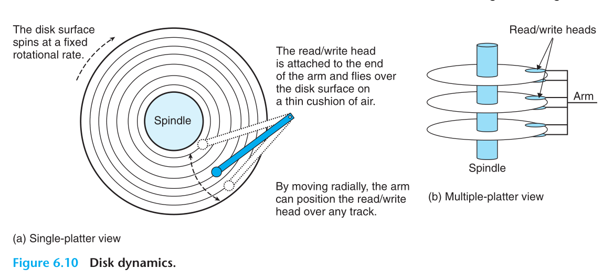

Seek time: typicallyon the order of 3 to 9 ms. The maximum time for a single seek, T max seek ,can be as high as 20 ms.

Rotational latency：

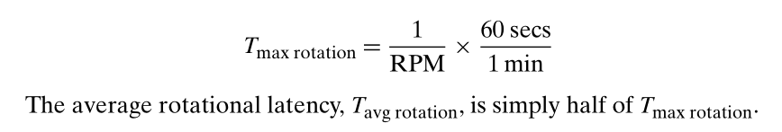

Transfer time：

一个扇区传送速度：

案例：

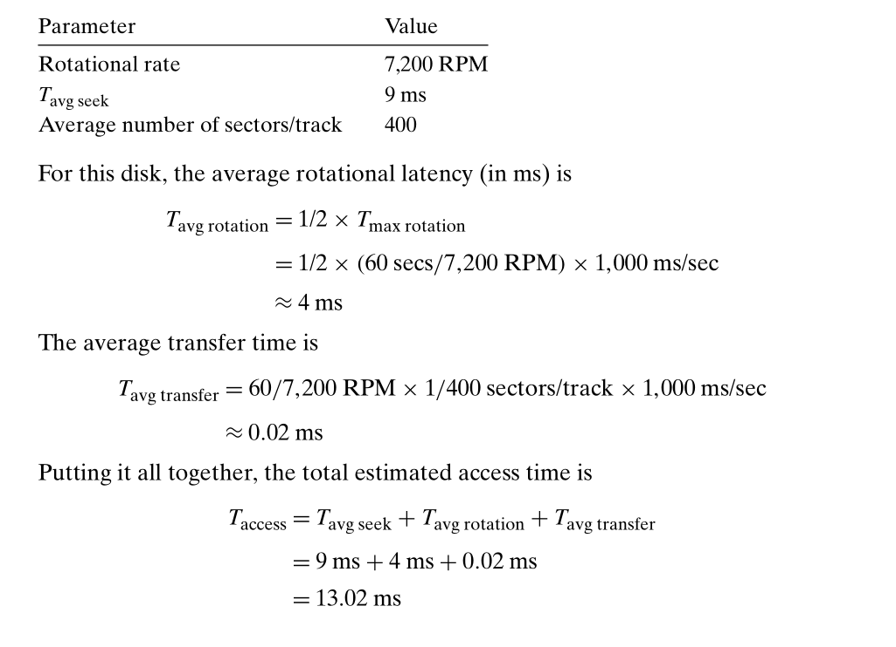

* 访问第一个字节耗费时间长，其余几乎不用时间
* 寻道跟旋转时间大致相同，用寻道x2简略为总时长

#### Logical Disk Blocks

读某个逻辑块号，查找快速表，翻译长一个(盘面、磁道、扇区)三元组，对应物理块号，控制器解释，将读写头移到柱面，复制到主存。

> 磁盘控制器必须对磁盘进行格式化，标识间隙、故障区域、备用区域

##### 练习题6.4

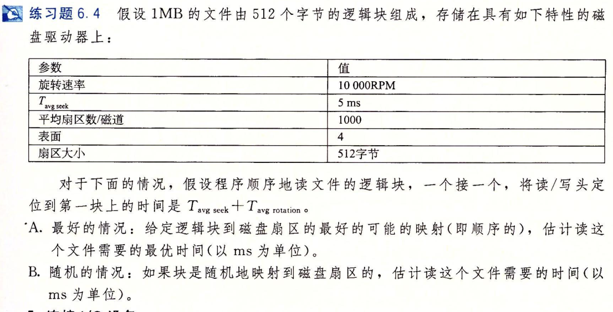

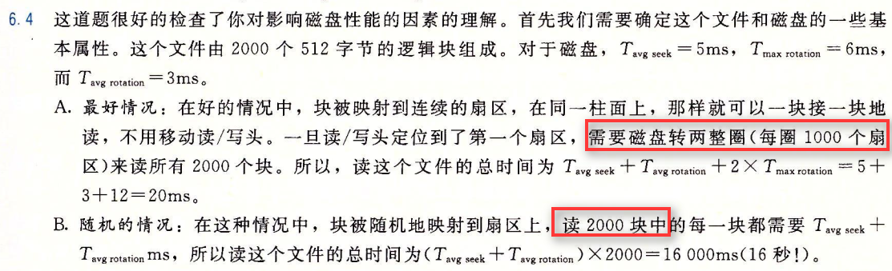

#### Connecting I/O Devices

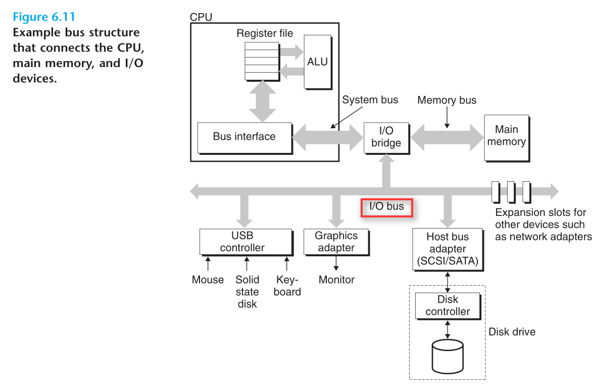

Universal Serial Bus(USB)：控制器是连接USB总线设备的中转机构

graphics card(or adapter)：显示器画像素

host bus adapter：连接磁盘。SCSI主机总线适配支持多个磁盘驱动器

#### Accessing Disks

1. 发信号
2. 读逻辑块号
3. 指明存主存地址

将读的内容直接传送到主存，不需要CPU干涉(设备自己执行读写)称为(Direct Memory Access DMA)，即DMA传送

DMA完成，磁盘控制器给CPU传送中断信号通知CPU。回到被中断的地方。

### 6.1.3 Solid State Disks

封装一个或多个闪存芯片和闪存翻译层组成。

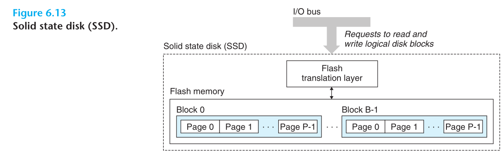

读比写快。

B个块，每个块P页，页大小512字节~4KB，块32~128页组成。

随机写慢：

1. 擦除块耗时较长。
2. 写已有数据，需要将有数据页复制到新块，才能对页p写入

## 6.2 Locality

时间局部性：引用一次很可能被多次引用

空间局部性：引用附近

引入高速缓存存储器。

### 6.2.1 Locality of References to Program Data

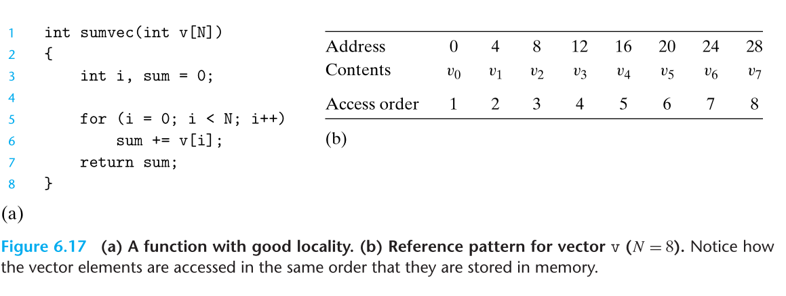

一维顺序，步长为1

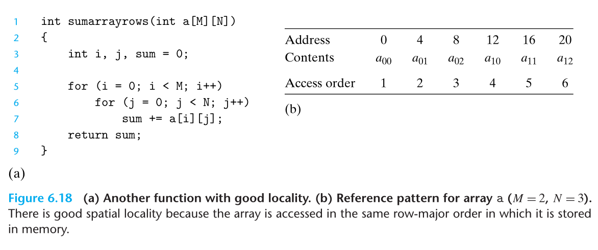

二维行优先顺序，步长为1的引用模式。

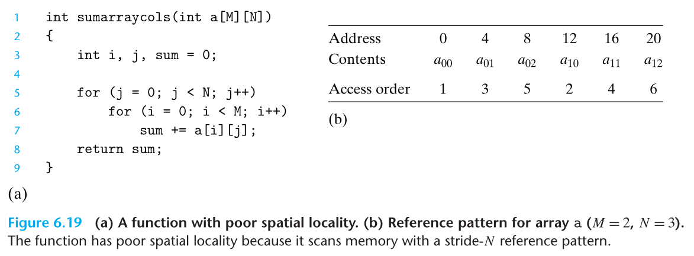

二维列优先，空间局部性差，数组在内存按行顺序存放，得到步长为N的引用模式。

### 6.2.2 Locality of Instruction Fetches

for循环重复执行指令，具有良好的空间和时间局部性。

### 6.2.3 Summary of Locality

* 步长越小，空间局部性越好。
* 循环迭代次数越多，循环体越小局部性越好

## 6.3 The Memory Hierarchy

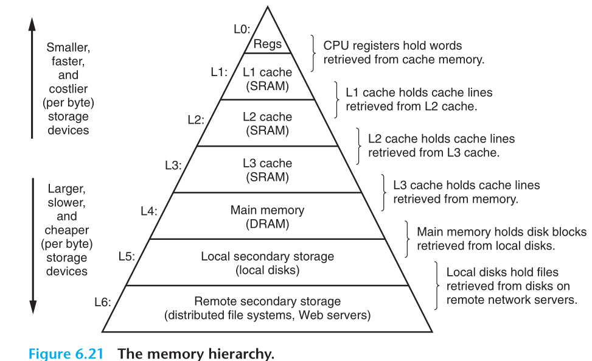

### 6.3.1 Caching in the Memory Hierarchy

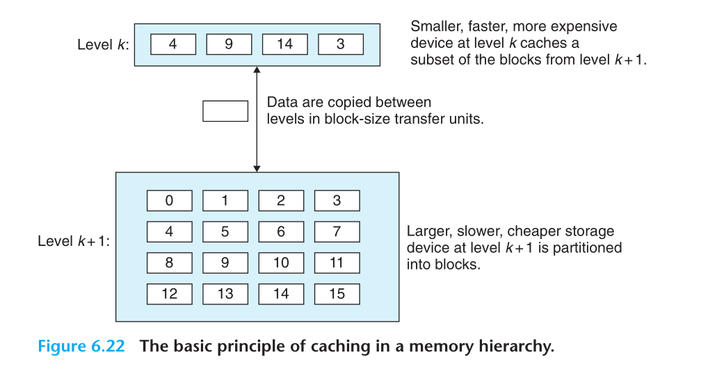

第k层会有更大的k+1层

层次结构较低层(离CPU远)，访问设备时间较长，倾向于使用较大的块。

#### Cache Hits

直接从第k层取出

#### Cache Misses

k+1层中找，缓存已满则覆盖(替换)，根据替换策略控制(LRU)。后序就能在第k层找到

#### Kinds of Cache Misses

k层为空：强制性不命中/冷不命中(短暂出现)

策略：

1. 随机放置：最优但实现昂贵
2. 固定块：重复冲突不命中
3. 按照某种循环

#### Cache Management

可以是硬件、软件或两者结合

### 6.3.2 Summary of Memory Hierachy Concepts

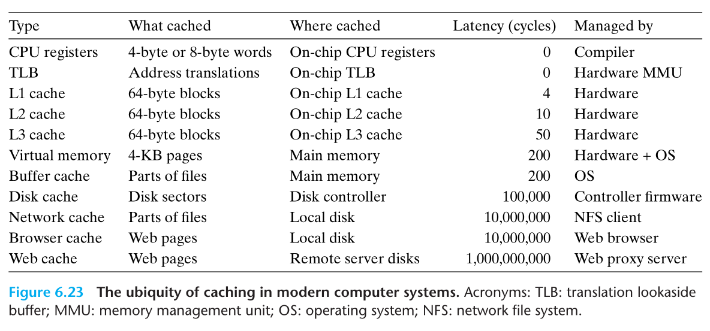

## 6.4 Cache Memories

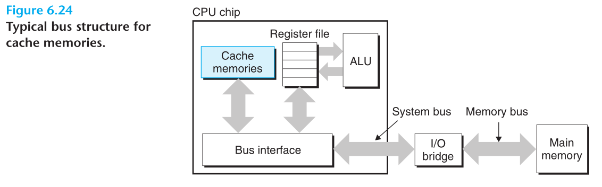

随着CPU和主存性能差距不断增大，还有L2和L3高速缓存。

### 6.4.1 Generic（通用的） Cache Memory Organization

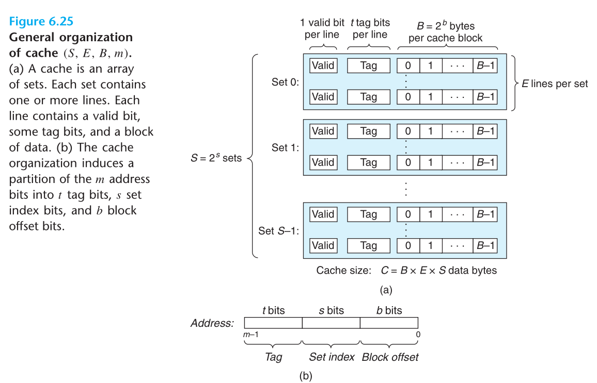

(S,E,B,m)

S个高速缓存组的数组。

每组有E个行

每行由B个字节数据块。

每组数组长度为m

1个有效位，m-(b+s)个标记位。

容量C=S × E × B

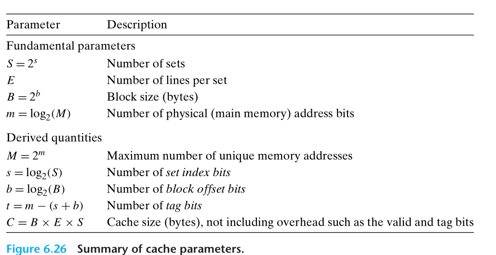

### 6.4.2 Direct-Mapped Caches

E=1称为直接映射高速缓存。

分为三步：组选择、行匹配、字抽取

#### Set Selection in Direct-Mapped Caches

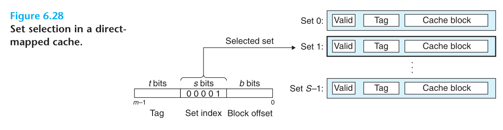

#### Line Matching in Direct-Mapped Caches

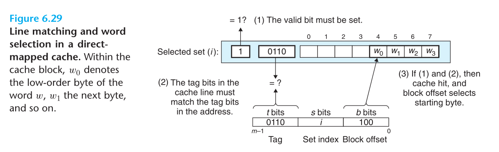

有效位为1，标签位相同，则命中

#### Word Selection in Direct-Mapped Caches

偏移量100表明w的副本是从块中的字节4开始的。

#### Line Replacement on Misses in Direct-Mapped Caches

从下一层取出，替换。

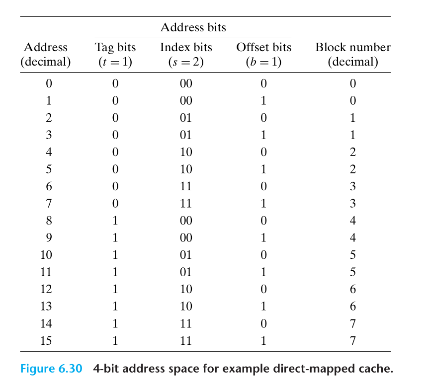

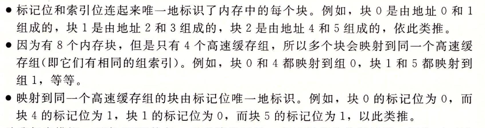

案例：

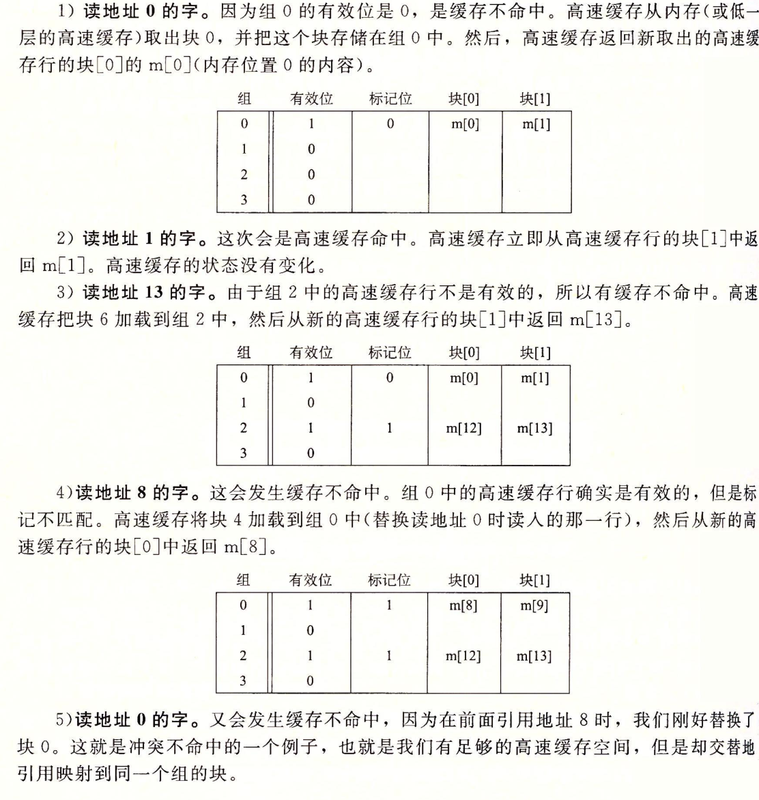

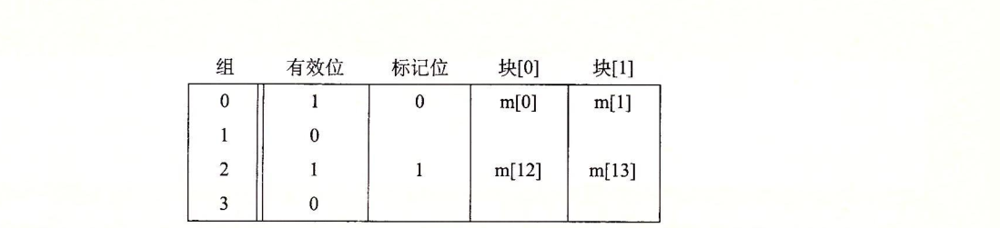

在这个例子中，通过地址去映射高速缓存，比如地址13，翻译二进制位1101，由于由2个块，占1位，4个组占2位，剩下1位为标记位，故翻译标志为1，组号为2中块1的位置。

#### Conflict Misses in Direct-Mapped Caches

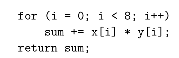

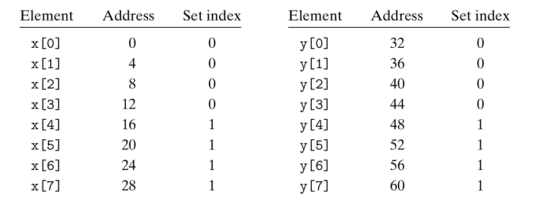

在调用的时候，y的调用会重复调用x调用的缓存组，导致了抖动现象的发生，全部不命中。

可以通过在每个数组结尾放字节填充，来避免映射到同个组中。

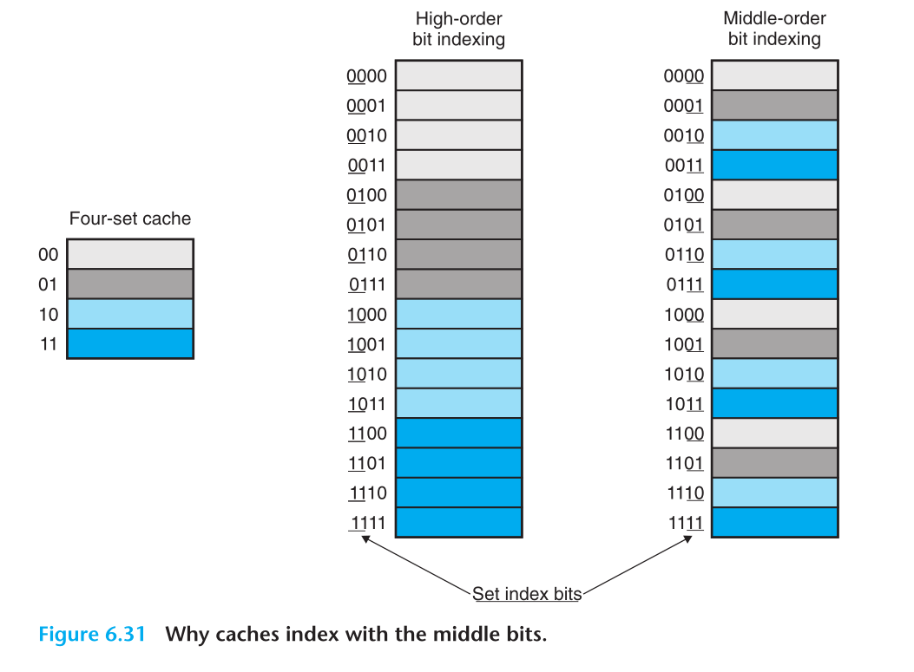

选择低位作为组索引，低位作为组映射可以让相邻的块映射到不同缓存行，能存放整个大小为C的数组片。

##### 练习题6.11

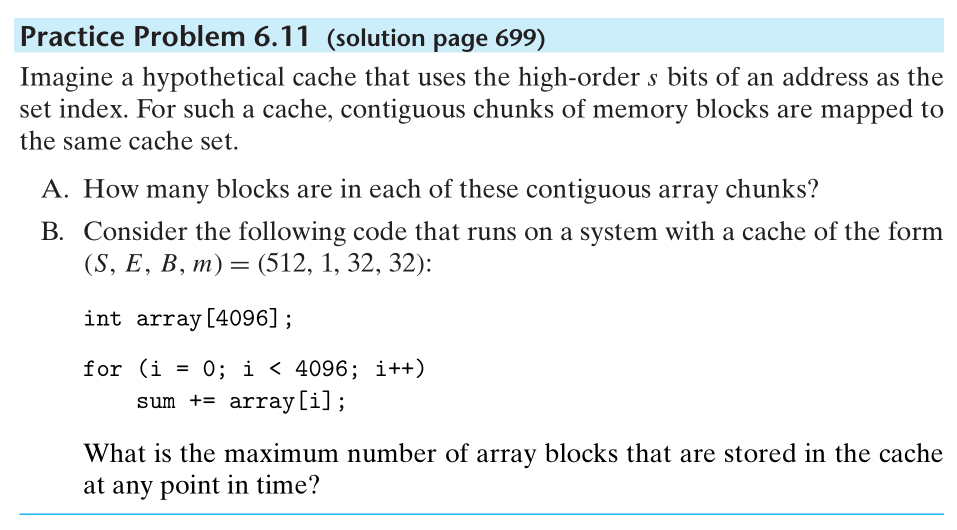

A.如果使用高位作为组索引，则会由2的t次方作为连续的组。

B.从(512,1,32,32)可以得到，s=9,b=5。故t=32-9-5=18，所以数组的头2的18次方的个数据会放在组1，由于数组只有(4096 × 4) / 32 = 512个块，故都会存在组0中，所以至多只能保存一个数组块。

### 6.4.3 Set Associative Caches

每组有多个缓存行。(1 < E < C/B)

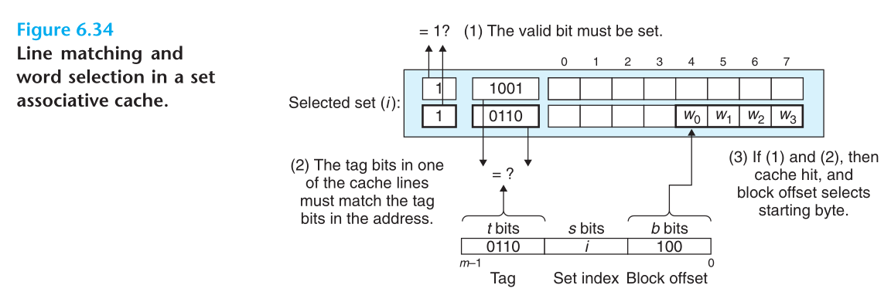

搜索组中每一行，找到标记与地址标记相匹配。则命中。

不命中有空行则作为候选，没有则进行替换。

### 6.4.4 Fully Associative Caches

包含所有高速缓存的组(E=C/B)，即一个组包含所有的行。

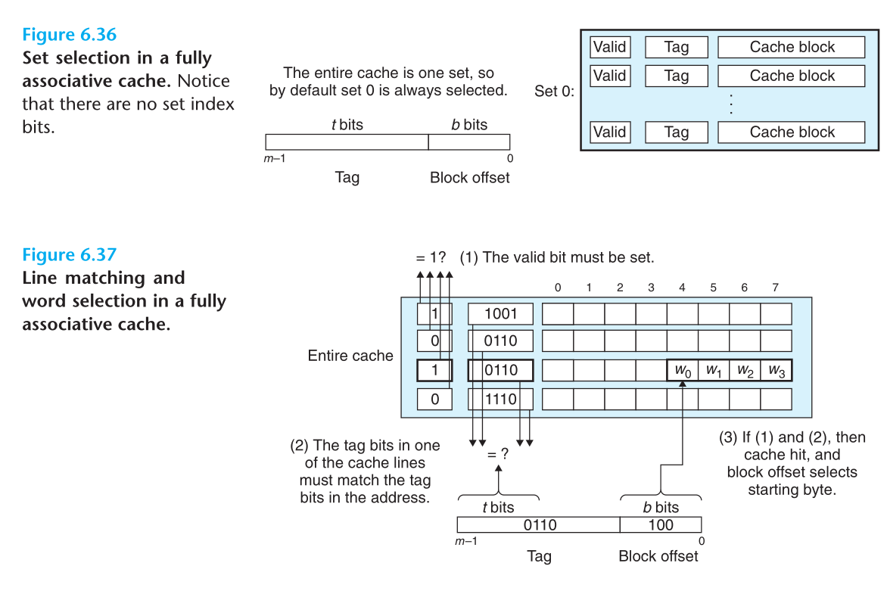

没有组索引位，只有标记位和块偏移。

**行匹配和字选择：**

1. 有效位
2. 标记位
3. 块偏移

昂贵，只适合做小的高速缓存，如TLB。

### 6.4.5 Issues with Writes

**write hit:**

write-through(直写)：每次都写回到低层

write-back(写回)：推迟到替换时，才写到低层。需要维护额外的修改位(dirty bit)

**write misses：**

write-allocate：加载低层块到高速缓存，更新高速缓存。**通常搭配写回**

not-write-allocate：避开高速缓存，直接写到低层。**通常搭配直写**

建议采用写回和写分配的模型。

### 6.4.6 Anatomy（剖析） of a Real Cache Herarchy

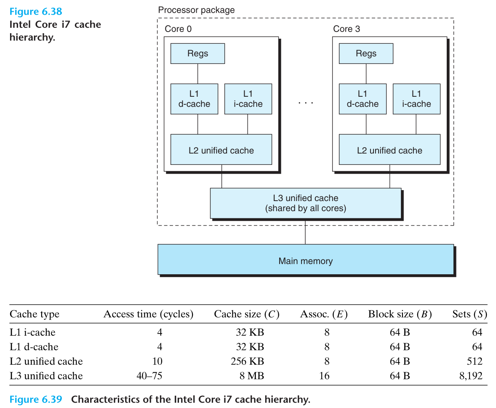

所有核共享L3

### 6.4.7 Performance Impact of Cache Parameters

块大小影响：块大缓存行数越少，传送时间也越长。

相联度影响：E大，降低冲突不命中出现抖动可能，但会造成较高的成本。命中时间和不命中处罚的折中。

写策略：高速缓存越往下，越使用写回而不是直写。

## 6.5 Writing Cache-Friendly Code

1. 让重要的部分运行更快
2. 较少每个循环内部缓存不命中数量
   1. 对局部变量(寄存器)反复引用
   2. 步长为1的引用模式
3. 多维数组局部性很重要

##### 练习题6.18

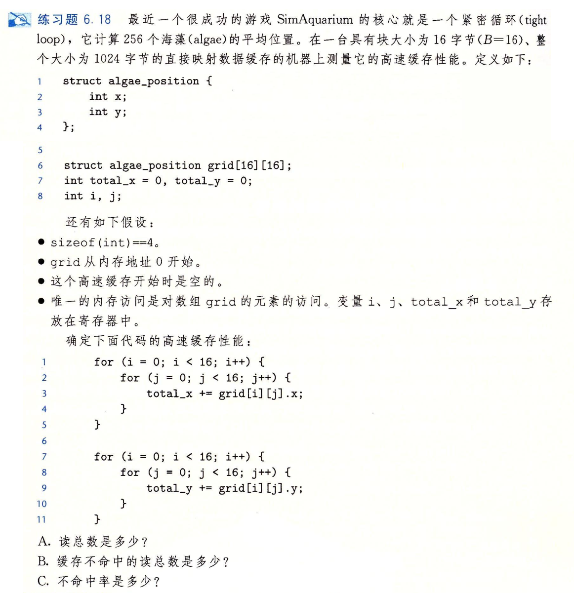

1024字节块大小16的直映射缓存，一共有64个组。每个数组占8个字节，每个块可以放2个数据。由于变量存在寄存器，不纳入读考虑

读总数`16*16*2=512`。第一次不命中会存入`[0][0].x|[0][0].y|[0][1].x|[0][1].y`  故会发生不命中`[0][0].x`、不命中`[0][1].x`。依次类推。

后面的127~256会覆盖前面的0~126个缓存，所以当第二次循环，会重新开始不命中、命中……

故不命中数为`16*16*2*0.5=256`

不命中率为`256/512=50%`

## 6.6 Putting It Together: The Impact of Caches on Program Performance

### 6.6.1 The Memory Mountain

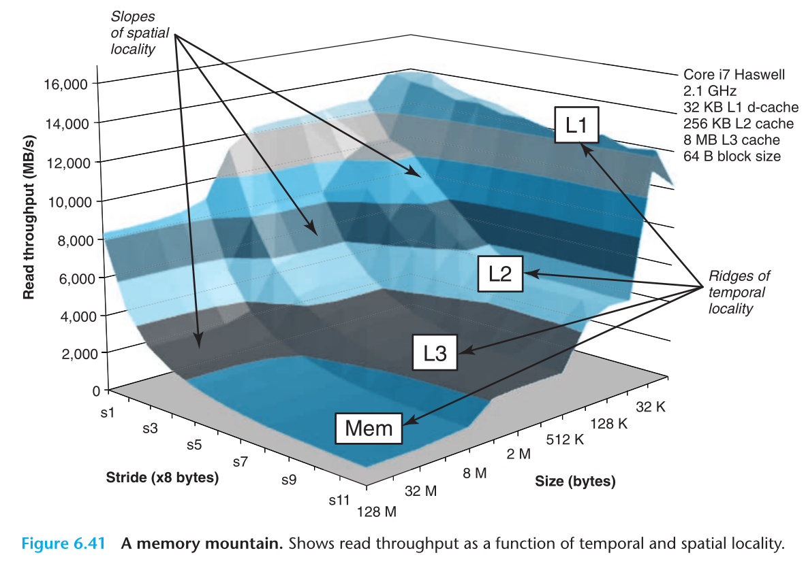

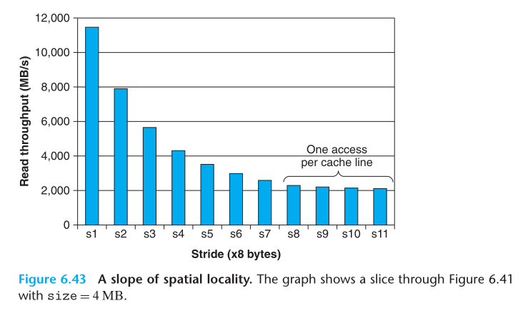

### 6.6.2 Rearranging Loops to Increase Spatial Locality

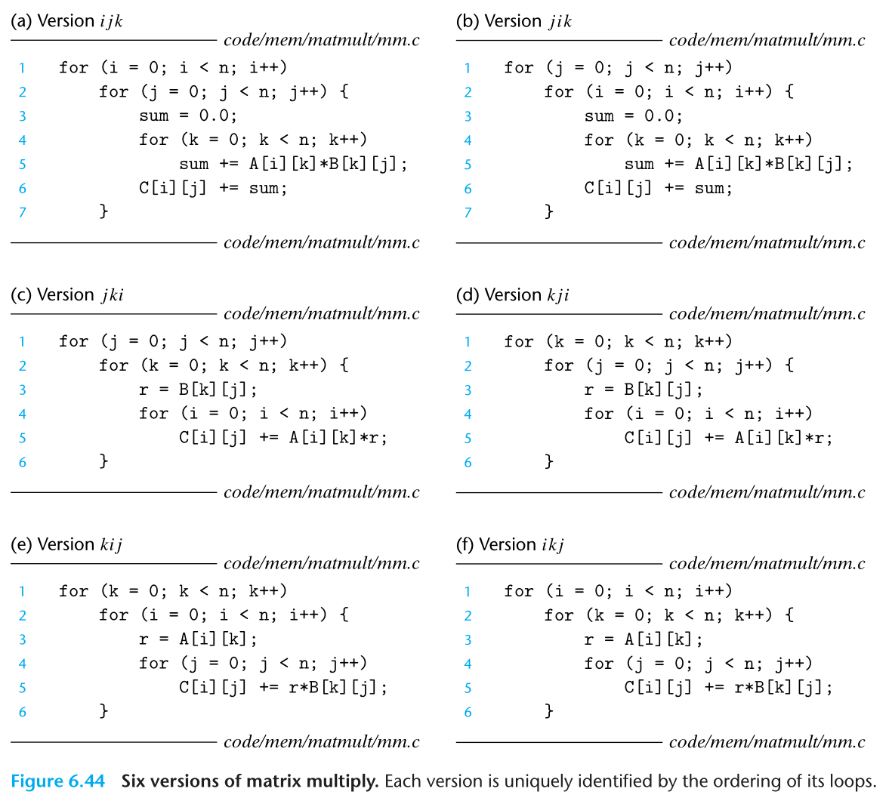

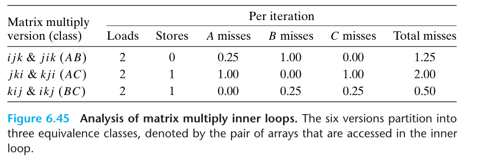

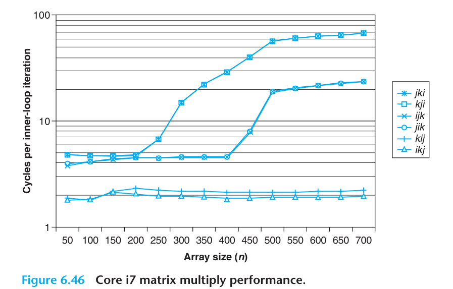