# Chapter 7：Linking

## 7.1 Compiler Drivers

首先C预处理器(C preprocessor cpp)将main.c翻译成ASCII码的中间文件main.i

接下来C编译器(C compiler ccl)，将main.i翻译成ASCII汇编文件main.s

最后汇编器(assembler as)将main.s翻译成可重定位目标文件main.o

通过链接器程序ld组合，创建可执行目标文件。

调用加载器函数，将代码和数据复制到内存。

## 7.2 Static Linking

1. Symbol resolution（符号解析）：目标文件定义和引用符号，每个符号对应一个函数、全局变量或静态变量。作用时将每个符号引用正好和一个符号定义关联
2. Relocation（重定位）：每个符号定义与内存位置关联起来。链接器产生重定位条目指令，执行重定位。

## 7.3 Object Files

Relocatable object file：与其他可重定位目标文件合并，创建可执行目标文件

Executable object file：可被直接复制到内存并执行

Shared object file：加载或运行时被动态加载进内存并链接。

编译器生成可重定位目标文件，链接器生成可执行目标文件。

目标文件是以文件形式存放在磁盘的目标模块(字节序列)

## 7.4 Relocatable Object Files

ELF头：描述生成该文件系统的字大小和字节顺序。剩余部分帮助链接器语法分析和解释目标文件信息

.text：已编译程序的机器代码

.rodata：只读数据，如printf语句的格式串和跳转表

.data：已初始化的全局和静态C变量。(局部变量运行时保存在栈中)

.bss：未初始化的静变量，以及所有被初始化为0的全局或静态变量。(占位符，不占据磁盘空间，内存分配时初始化为0。)

.symtab：符号表，定义和引用函数和全局变量信息。

.rel.text：一个.text节中位置的列表，和其他文件组合时需要修改。调用外部函数或引用全局变量都需要修改。

.rel.data：被模块引用或定义的所有全局变量的重定位信息。初始化时全局变量地址或外部定义函数地址都需要被修改。

.debug：调试符号表，定义的局部变量和类型定义，定义和引用的全局变量，原始C源文件。 -g调用才得到

.line：C源程序行号和.text节机器指令之间映射。 -g调用得到

.strtab：字符串表：包括.symtab和.debug中的符号表，节头部中的节名字。

节头部表：不同节位置和大小的描述。

## 7.5 Symbols and Symbol Tables

* 由模块m定义并能被其他模块引用的全局符号：

* 由其他模块定义并被模块m引用的全局符号：其他模块定义非静态C函数和全局变量
* 只被模块m定义和引用的局部符号：带static的C函数和全局变量

不包含本地非静态变量的任何符号，在栈中管理。

用编译器输出到汇编语言.s文件中的符号

name：字节偏移

value：符号地址

size：目标大小

type：数据或函数

binding：本地或者全局

section：分配目标文件的某个节

特殊的伪节：ABS：不该被重定位的符号、UNDEF：非定义的符号、COMMON：未初始化的全局变量

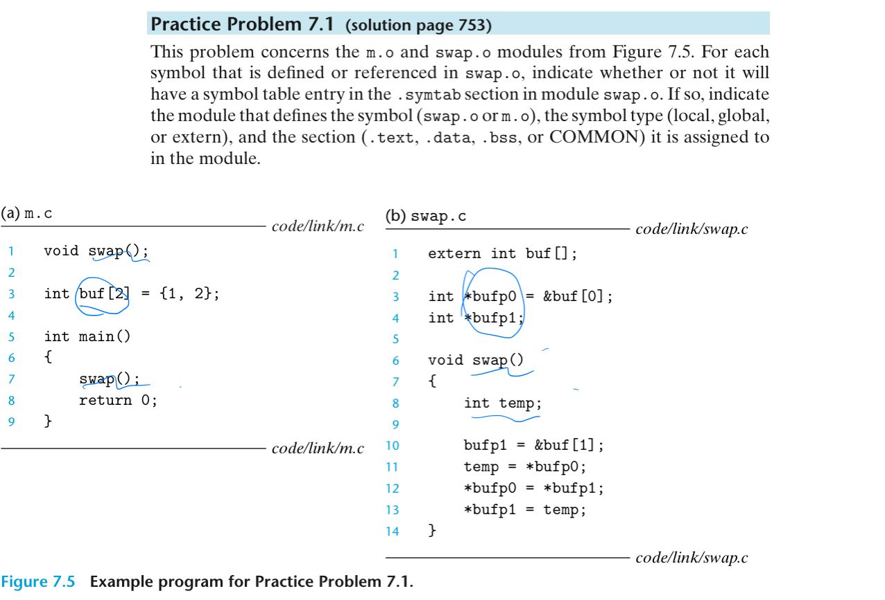

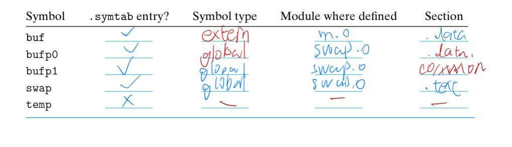

buf在main中声明，但实际上被用于外部调用，所以Symbol type 类型是外部类型。

bufp0指针地址引用，但在swap中作为全局变量使用。

## 7.6 Symbol Resolution（符号解析）

### 7.6.1 How Linkers Resolve Duplicate Symbol Names

函数和已初始化的全局变量是强引用，未初始化的全局变量是弱引用。

1. 不允许多个同名的强符号
2. 一个强符号和多个弱符号同名，那么选择强符号
3. 多个弱符号同名，那么从弱符号任意选一个

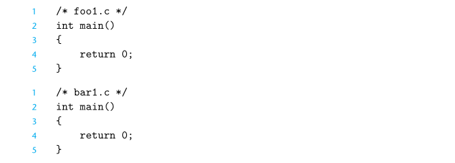

多个同名函数强符号(规则1)，不可用

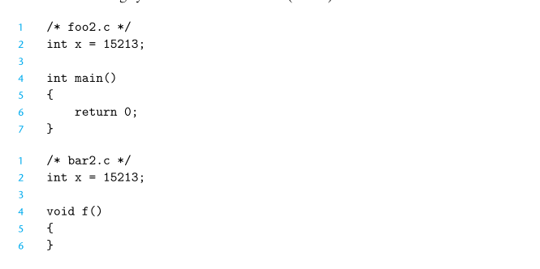

多个同名全局变量强符号(规则1)，不可用

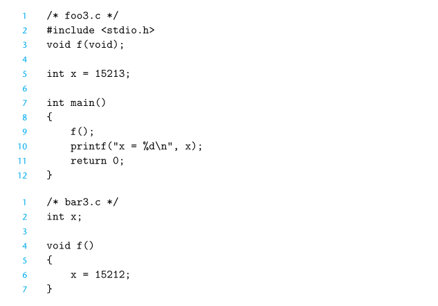

在一个模块x未初始化，则选择另一个模块定义的强符号(规则2)。

运行时函数f将x值做了修改，会给原模块带来破坏

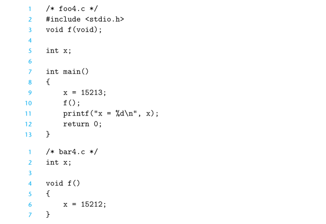

两个弱引用，由于规则3，会任意选一个，造成不易察觉的错误。

一个用int，4个字节。 一个用double，8个字节。

f函数将x赋值为-0.0会将内存中x和y的内容覆盖。得到如下错误

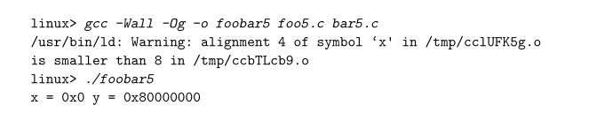

这个错误只会触发连接器发出一条警告。执行很久才表现出来。

当编译器遇到弱全局，不确定其他模块是否定义了x， 所以把x分配给COMMON，决定权交给连接器。

x初始化为0则为强符号，则可以自信的分配给.bss

静态符号的构造必须唯一，可以分配成.data或.bss

### 7.6.2 Linking with Static Libraries

将所有相关的目标模块打包成为一个单独的文件，成为静态库(Static library)

如果不适用静态库

1. 让编译器辨认对标准函数的调用，直接生成对应的代码(增加编译器复杂性)
2. 将所有标准C函数放在单独可重定位目标模块，链接到可执行文件。(每个都要放副本到内存，内存浪费，修改也困难)
3. 每个标准函数创建独立可重定位文件，要求程序员显式链接合适的目标模块到她们的可执行文件，耗时容易出错

静态库通过指定单独文件使用库中定义的函数，只赋值被程序引用的目标模块

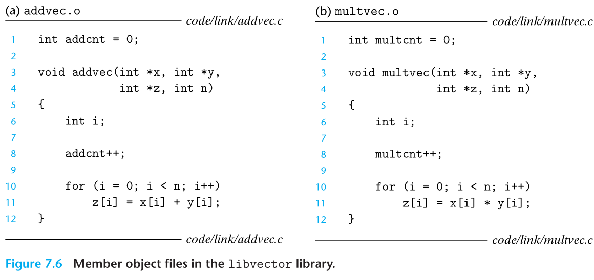

定义两个libvector库中的成员目标文件，通过AR工具，加入到这个库中

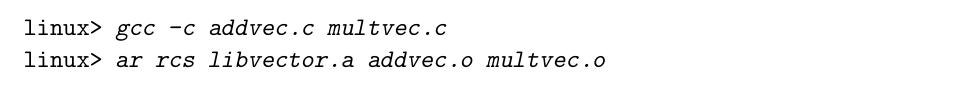

为使用这个库，调用addvec，vector.h定义了libvector.a中例程的函数原型

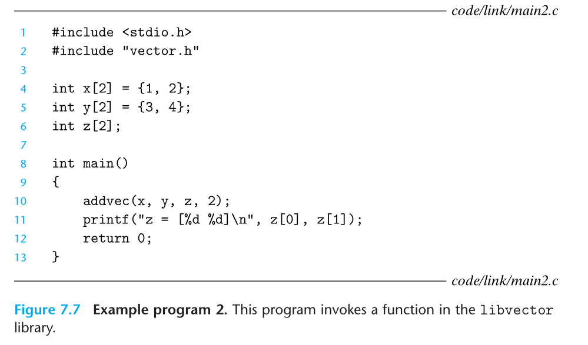

编译和链接输入文件main.o和libvector.a

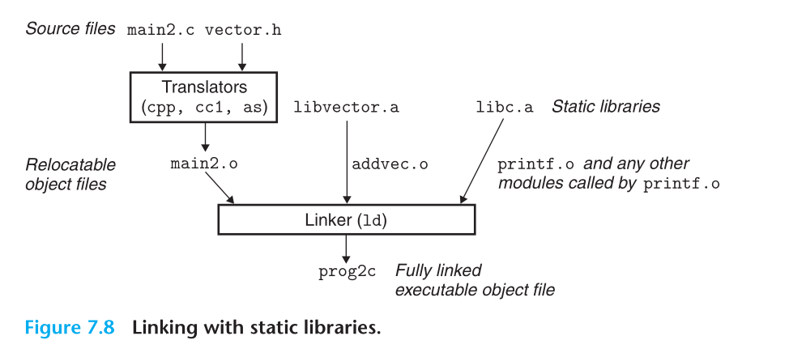

复制addve.o到可执行文件，并且复制libc.a中的printf.o

### 7.6.3 How Linkers Use Static Libraries to Resolve References

链接器维护**可重定位目标文件集合E，未解析的符号集合U，前面输入文件中已定义的符号集合D**。初始时均为空。

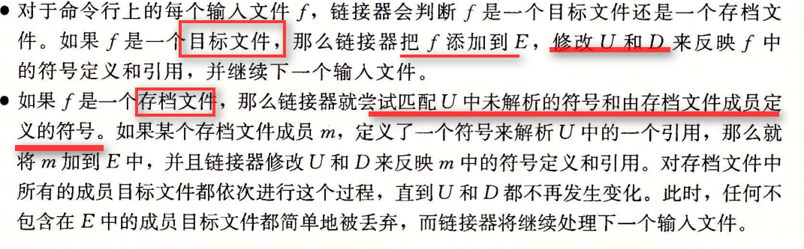

扫描后U非空，错误并终止，  否则输出可执行文件。

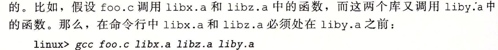

foo.c -> libx.a ,libz.a -> liby.a

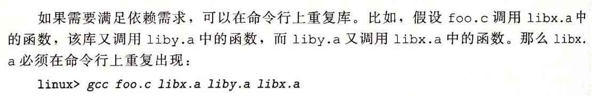

foo.c ->llibx.a->liby.a->libx.a

也可以将libx.a 和liby.a合并单独的存档文件。

##### 练习题7.3

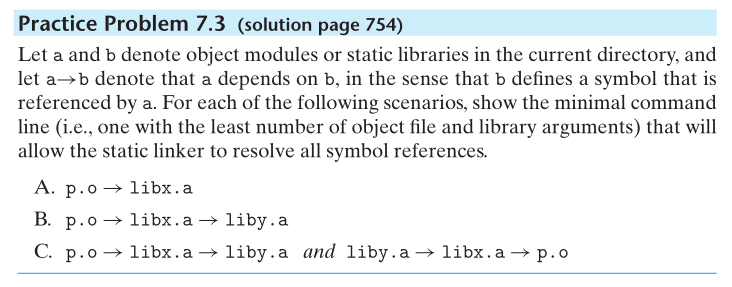

1. gcc p.o libx.a
2. gcc p.o libx.a liby.a
3. gcc p.o libx.a liby.a libx.a (p.o)

没有依赖可以任意顺序，依赖必须排序， 而重复调用函数需要重复出现，初始调用的代码不需要重复出现，如3中的p.o可忽略

## 7.7 Relocation

重定位步骤：

1. 重定位节（sections）和符号定义：相同类型节合并同一类型新的聚合节
2. 重定位节中的符号引用：修改代码节和数据节对每个符号引用，指向正确运行位置

### 7.7.1 Relocation Entries（重定位条目）

告诉链接器将在**目标文件**合并成**可执行文件**如何修改引用。

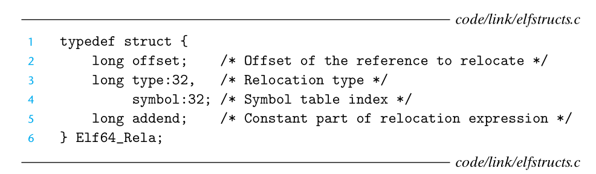

offset：被修改的引用节偏移

symbol：被修改引用指向的符号

type：如何修改新引用

addend：被修改引用的值做偏移调整

32种重定位类型，基本两种：

R_X86_64_PC32：相对地址引用（PC+value）

R_X86_64_32：绝对地址引用

### 7.7.2 Relocation Symbol References

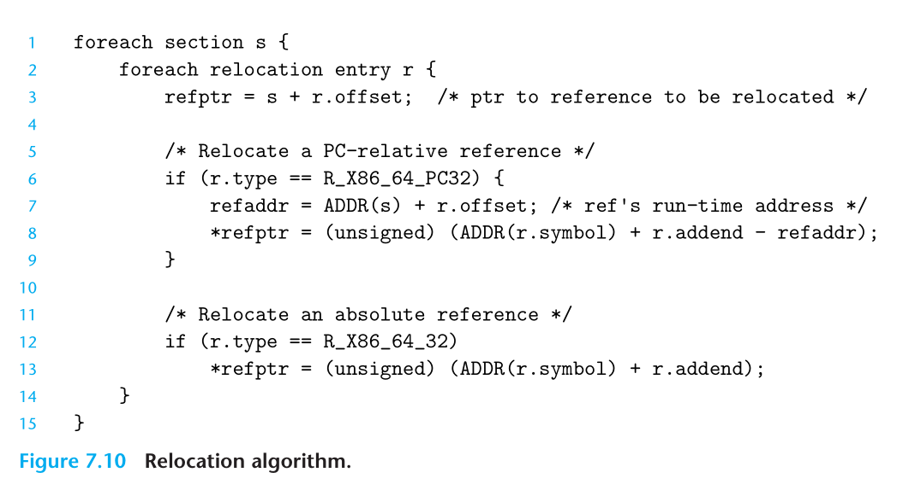

双重迭代从节点开始遍历每个条目。

先加上偏移地址，判断为相对寻址还是绝对寻址，进行重定位。

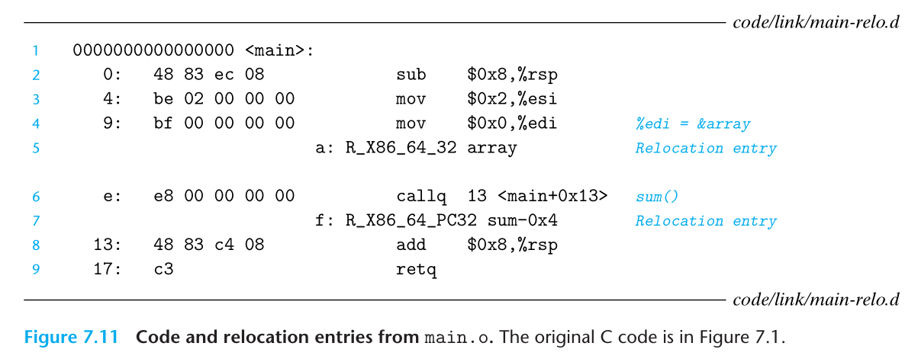

#### Relocationg PC-Relative References

在0xe位置调用sum，得到重定位的条目解析如下

修改开始于偏移量0xf处  32位相对引用。按照算法规则进行计算。

假设

ADDR(s) = ADDR(.text) = 0x4004d0

ADDR(r.symbol) = ADDR(sum) = 0x4004e8

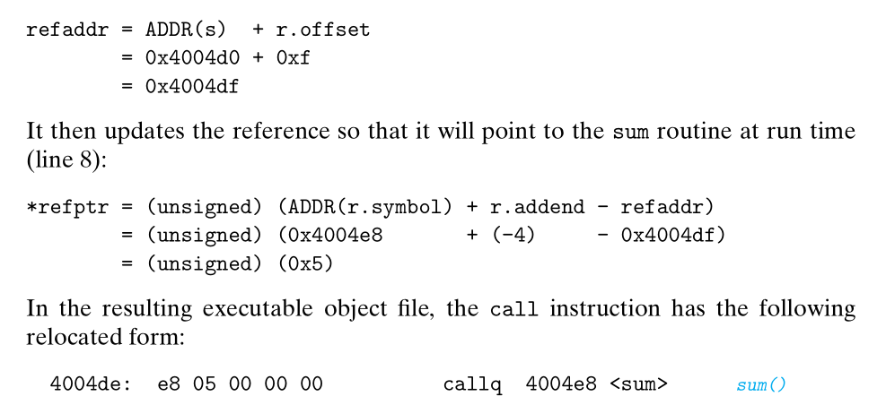

计算出相对引用的地址为0x5

接下来进行调用

1. 先将PC(0x4004e3)压入栈中。(该地址为4004de的下一个地址，即+0x4)
2. 将PC=PC+0x5作为新的调用地址。即调用sum函数

#### Relocating Absolute References

array为变量，通过绝对引用确定变量位置。

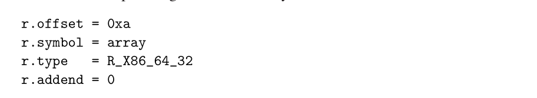

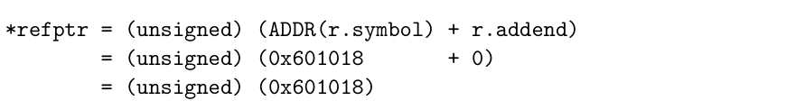

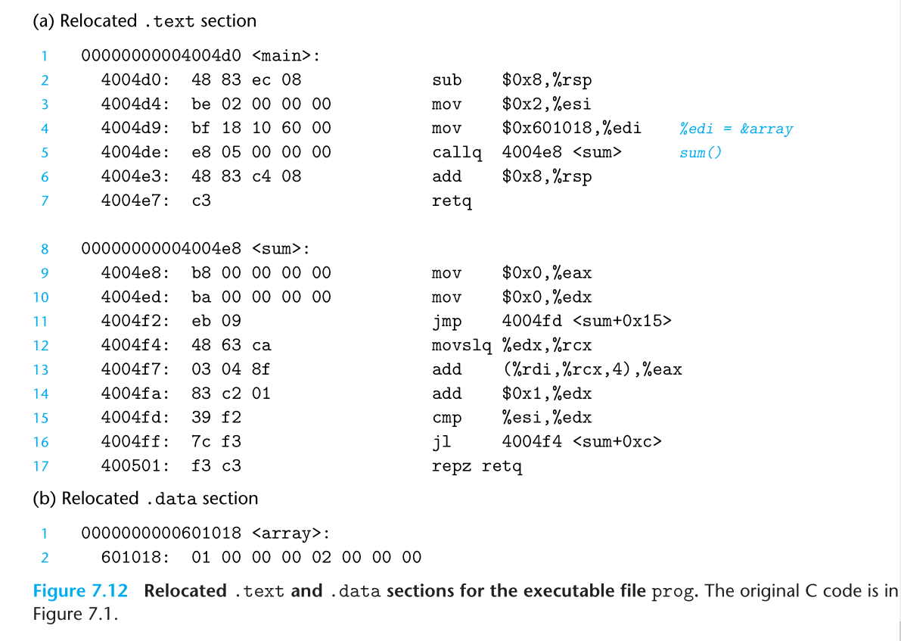

##### 练习题7.4

relocate reference address：

redaddr=ADDR(s) + r.offset=0x4004de+0xf=0x4004ef

relocate reference address：

*refptr = (unsigned) (ADDR(r.symbol) + r.addend - refaddr)=0x5

##### 练习题7.5

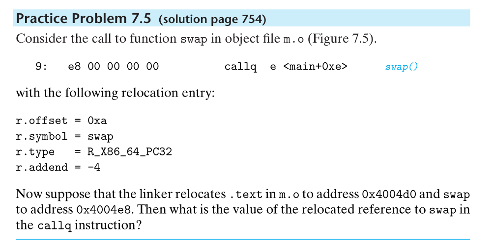

相对引用地址，0x4004d0+0xa=0x4004da

相对引用值：0x4004e8 - 0x4004da - 4 = 0xa

最终得到 ：

`40004d9:  e8 0a 00 00 00  callq 4004e8<swap>`

## 7.8 Executable Object Files

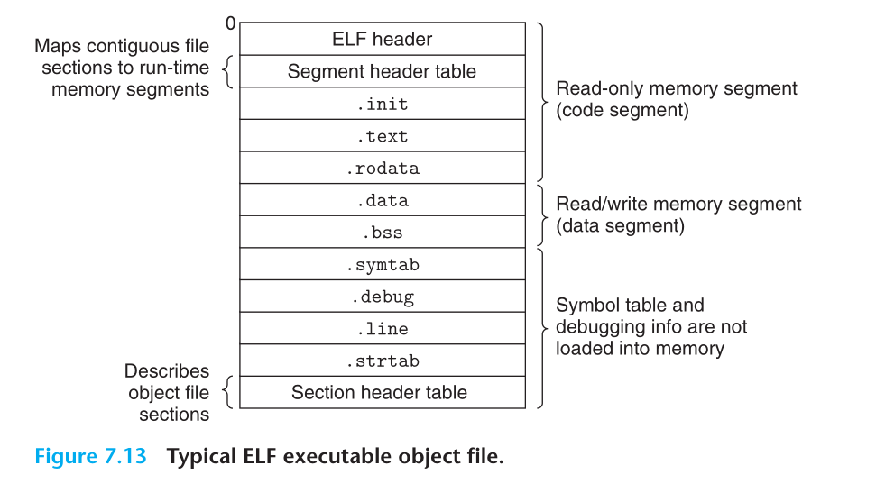

类似可重定位目标文件。

还包含entry point，程序第一条指令地址。

.init节定义了_init函数，用于初始化代码时调用。

已被重定位，不需要rel节

**程序头部表**

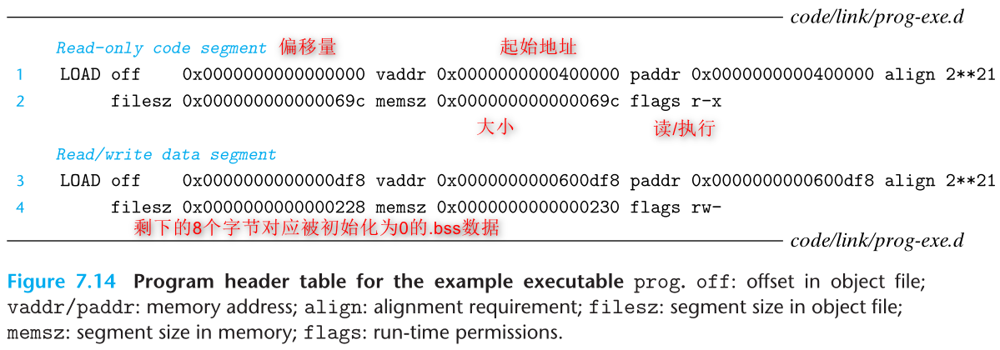

需要选择一个起始地址addr 使得：

## 7.9 Loading Executable Object Files

加载：加载器将可执行目标文件中代码和数据从磁盘复制到内存，跳转到程序入口点运行。

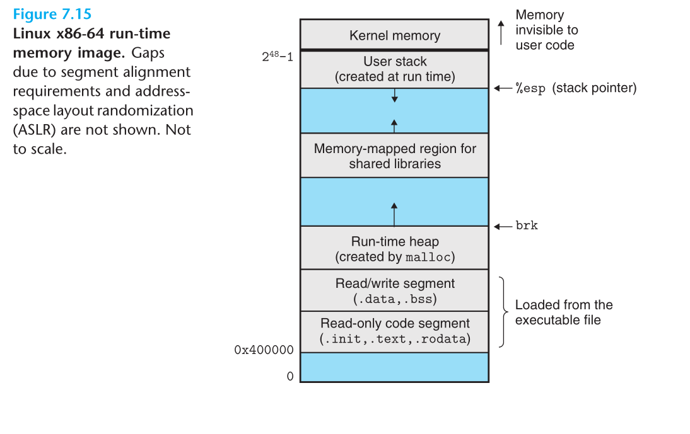

代码段总是从0x400000处开始，后面是数据段。运行时堆在数据段之后，通过malloc增长。

用户栈从最大合法用户地址(2的48次方-1)开始。

还会使用空间布局随机化(ASLR)，但相对位置是不变的。

_start函数调用系统启动函数__lib_start_main，定义在libc.so调用main

>  关于加载，shell运行程序，父进程生成子进程，是父进程的复制。子进程通过execve系统调用启动加载器。加载器删除子进程现有的虚拟内存段，创建一组新的代码、数据、堆和栈段。初始化为零。映射到可自行文件的页大小的片，初始化为可执行文件内容。最后加载器跳转到_start地址，调用main函数。直到CPU引用一个被映射的虚拟页才进行复制，将页面从磁盘传送到内存。

## 7.10 Dynamic Linking with Shared Libraries

动态链接：共享库是一个目标模块，运行或加载时，可以加载到任意的内存地址，并和内存中的程序链接起来。.so后缀  (微软共享库称为DLL)

一个共享库的.text节副本可以被不同正在运行的程序共享。

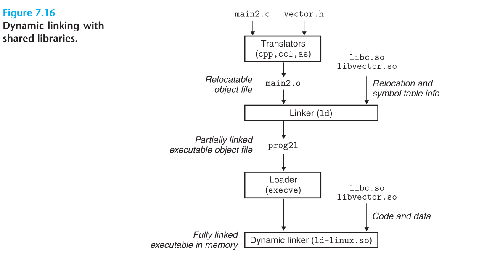

先创建共享目标文件libvector.so

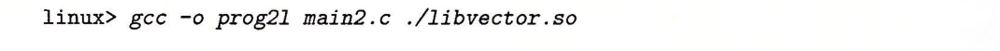

运行时可以和libvector.so链接

链接器复制了一些重定位和符号表信息，使得运行时可以解析对libvecctor.so代码和数据的引用。

**并不像静态库那样被复制和嵌入到引用它们的可执行文件中**

## 7.11 Loading and linking Shared Libraries from Applications

动态链接应用：

分发软件：代替当前版本

构建高性能Web服务器：生成动态内容

提供简单接口，允许应用程序在运行时加载和链接共享库。

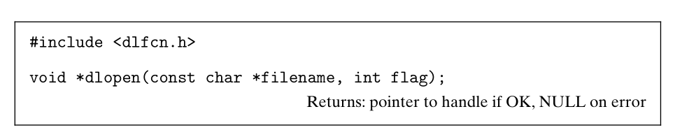

加载和链接共享库filename

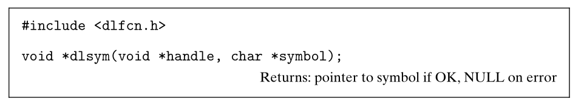

指向前面已经打开的共享库的句柄和一个symbol名字

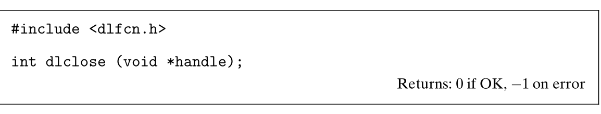

没有正在使用的，卸载共享库

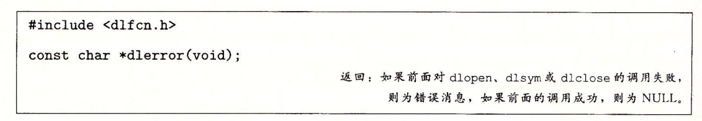

返回调用函数发生的错误

## 7.12Position-Independent Code (PIC)

无限多个进程可以共享一个共享模块的代码段的单一副本

加载不需要重定位的代码

#### PIC Data References

在数据段开始的地方创建全局偏移量表(GOT)。GOT每个条目生成重定位记录。加载时动态链接器重定位条目，包含正确的绝对位置。

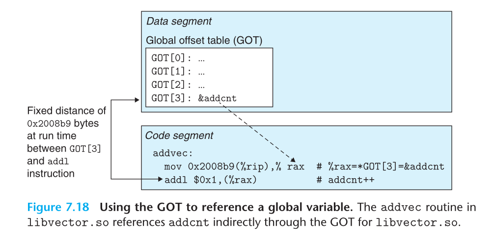

由于代码段和数据段距离相同，则GOT的每个位置都有固定距离。

#### PIC Function Calls

延迟绑定：将过程地址的绑定推迟到第一次调用该过程时

利用GOT和过程链接表(PLT)实现。

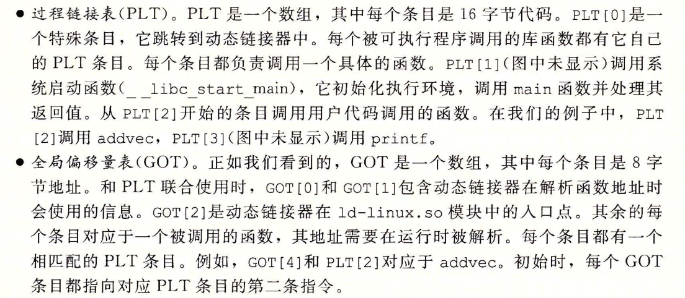

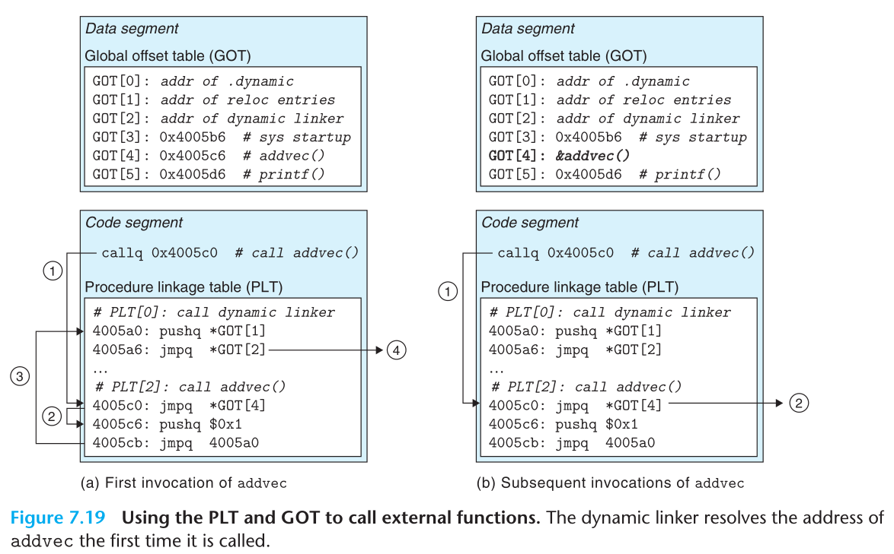

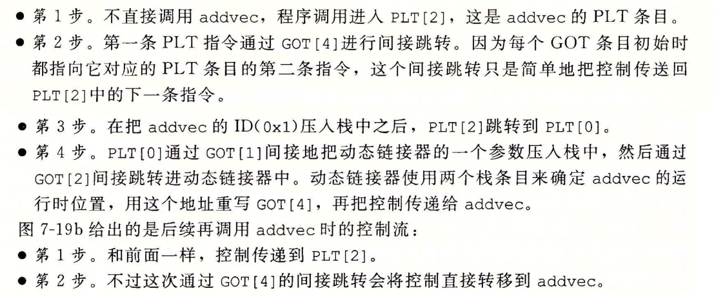

## 7.13 Library Interpositioning

允许截获对共享库函数的调用，取而代之执行自己的代码。

追踪某个特殊库函数的调用次数，验证和追踪它的输入和输出值，甚至替换完全不同的实现。

思想：给定需要打桩的目标函数，创建一个包装函数。欺骗系统调用包装函数而不是目标函数

### 7.13.1 compile-Time Interpositioning

包装函数调用目标函数，得到编译信息

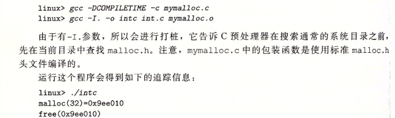

### 7.13.2 Link-Time Interpositioning

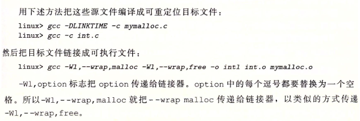

### 7.13.3 Run-Time Interpositioning

编译打桩需要访问程序源代码

连接时打桩需要访问程序的可重定位对象文件

运行时需要访问可执行文件，基于动态链接器的LD_PRELOAD环境遍历

有限搜索LD_PRELOAD库，才搜索其他库

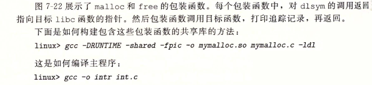

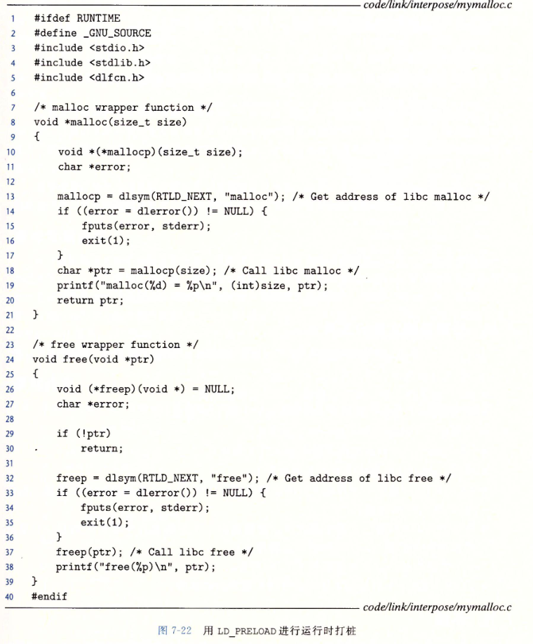

## 7.15 Summary

链接：编译时由静态编译器完成，或加载和运行时由动态链接器完成。

目标函数：可重定位、可执行、共享的

链接器：符号解析（全局符号绑定唯一定义）、重定位（确定每个符号的最终内存地址）

静态链接器：多个可重定位目标文件合并单独可执行文件

链接器错误：1.多个目标文件定义相同符号、2.链接器从左到右扫描解析符号引用

加载器：可执行文件内容映射到内存并运行

动态链接器，加载共享库和重定位程序中的引用

位置无关代码：加载到任何地方，多个进程共享。
