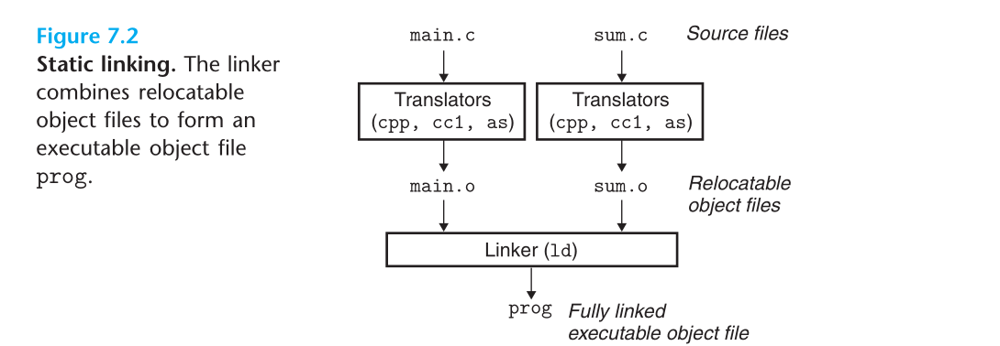
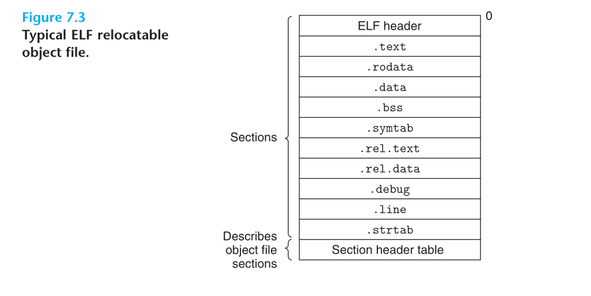
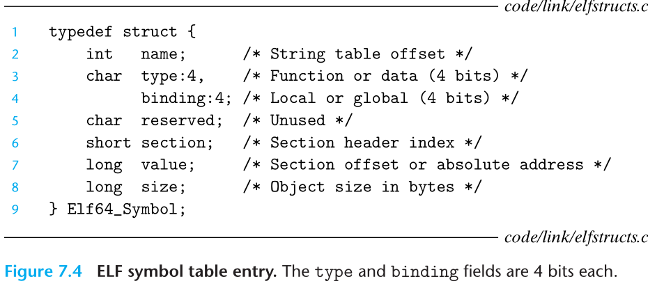
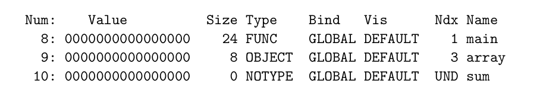

# Chapter 7：Linking

## 7.1 Compiler Drivers

首先C预处理器(C preprocessor cpp)将main.c翻译成ASCII码的中间文件main.i

接下来C编译器(C compiler ccl)，将main.i翻译成ASCII汇编文件main.s

最后汇编器(assembler as)将main.s翻译成可重定位目标文件main.o

通过链接器程序ld组合，创建可执行目标文件。

调用加载器函数，将代码和数据复制到内存。

## 7.2 Static Linking

1. Symbol resolution（符号解析）：目标文件定义和引用符号，每个符号对应一个函数、全局变量或静态变量。作用时将每个符号引用正好和一个符号定义关联
2. Relocation（重定位）：每个符号定义与内存位置关联起来。链接器产生重定位条目指令，执行重定位。

## 7.3 Object Files

Relocatable object file：与其他可重定位目标文件合并，创建可执行目标文件

Executable object file：可被直接复制到内存并执行

Shared object file：加载或运行时被动态加载进内存并链接。

编译器生成可重定位目标文件，链接器生成可执行目标文件。

目标文件是以文件形式存放在磁盘的目标模块(字节序列)

## 7.4 Relocatable Object Files

ELF头：描述生成该文件系统的字大小和字节顺序。剩余部分帮助链接器语法分析和解释目标文件信息

.text：已编译程序的机器代码

.rodata：只读数据，如printf语句的格式串和跳转表

.data：已初始化的全局和静态C变量。(局部变量运行时保存在栈中)

.bss：未初始化的全局和静态C变量，以及所有被初始化为0的全局或静态变量。(占位符，不占据磁盘空间，内存分配时初始化为0。)

.symtab：符号表，定义和引用函数和全局变量信息。

.rel.text：一个.text节中位置的列表，和其他文件组合时需要修改。调用外部函数或引用全局变量都需要修改。

.rel.data：被模块引用或定义的所有全局变量的重定位信息。初始化时全局变量地址或外部定义函数地址都需要被修改。

.debug：调试符号表，定义的局部变量和类型定义，定义和引用的全局变量，原始C源文件。 -g调用才得到

.line：C源程序行号和.text节机器指令之间映射。 -g调用得到

.strtab：字符串表：包括.symtab和.debug中的符号表，节头部中的节名字。

节头部表：不同节位置和大小的描述。

## 7.5 Symbols and Symbol Tables

* 由模块m定义并能被其他模块引用的全局符号：

* 由其他模块定义并被模块m引用的全局符号：其他模块定义非静态C函数和全局变量
* 只被模块m定义和引用的局部符号：带static的C函数和全局变量

不包含本地非静态变量的任何符号，在栈中管理。

用编译器输出到汇编语言.s文件中的符号

name：字节偏移

value：符号地址

size：目标大小

type：数据或函数

binding：本地或者全局

section：分配目标文件的某个节

特殊的伪节：ABS：不该被重定位的符号、UNDEF：非定义的符号、COMMON：未初始化的全局变量

