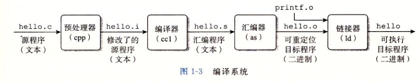
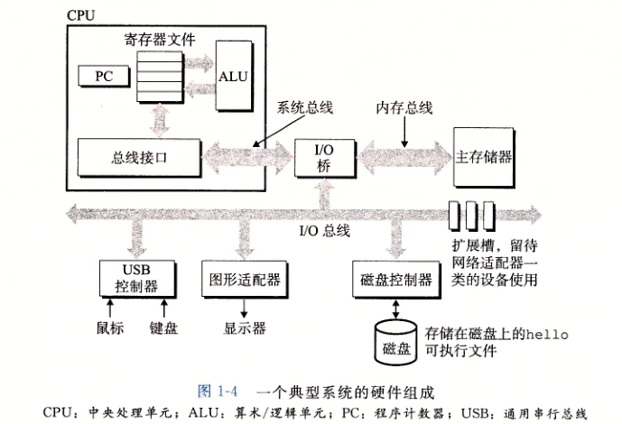
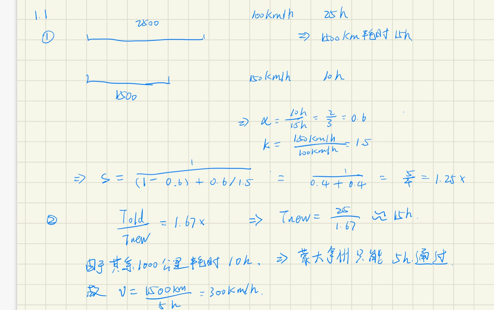

# 第1章：计算机系统漫游

## 1.2程序被其他程序翻译成不同的格式

* **预处理器、编译器、汇编器和连接器**构成**编译系统**

**预处理阶段**：#include<stdio.h>开头的原始C程序

**编译阶段**：包含一个汇编语言程序，如第三章的汇编代码

**汇编阶段**：翻译成机器语言指令，打包成 **可重定位目标程序**，保存在hello.o的**二进制文件**

**链接阶段**：调用了printf函数，在printf.o的单独预编译好的目标文件，通过**链接器**进行合并，成为**可执行文件**，可以**加载到内存**

## 1.4处理器读并解释村粗在内存中的指令

## 1.4.1系统的硬件组成

1. **总线**：**携带信息字节**并负责在**各个部件间进行传递**。字节块长度，成为字（word）
2. **I/O设备**：**系统与外部联系通道**。如鼠标、键盘、显示器、磁盘。I/O设备通过**控制器或适配器**与总线相连
   * 控制器：I/O设备本身或者主板上的芯片组
   * 适配器：插在主板插槽上的卡
3. **主存**：**临时存储设备**，存放程序和程序处理的数据。
   * 物理上：动态随机存取存储器（DRAM）芯片组成
   * 逻辑上：线性的字节数组，有唯一的地址（数组索引）
4. **处理器（CPU）**：**解释（或执行）存储在主存中指令**的引擎。核心大小为一个字的**程序计数器（PC）**。
   * 指令集架构：按照严格顺序执行，一条指令包含一系列步骤
   * 围绕**主存、寄存器文件和算数/逻辑单元(ALU)**进行。
   * **寄存器文件**：小的存储设备
   * **逻辑单元(ALU)**：计算新数据和地址值
     * 加载、存储、操作、跳转操作

### 1.4.2运行hello程序

* shell读取输入字符串"./hello"将字符逐个读入**寄存器**放入**内存**，如下图

1. **回车**，结束输入，执行一系列指令**加载和执行**hello文件。将代码和数据**从磁盘复制到主存**，最终输出字符串
2. 利用**直接存储器存储(DMA)**可以不通过处理器**直接从磁盘到达主存**，如下图

* 处理器开始**执行**hello中main程序的**机器语言指令**，将字符串的字节**从主存复制到寄存器文件**，**再复制到显示器**

## 1.5高速缓存至关重要

**高速缓存存储器：****L1位于处理器芯片**，速度**几乎**和寄存器文件**一样**。**L2**通过一条特殊总线连接**处理器，比L1长5倍，比主存快5-10倍。由**静态随机访问存储器（SRAM）**硬件技术实现

## 1.6存储设备形成的层次结构

快到慢：寄存器、L1~L3、主存、本地磁盘、远程服务器

**上一层作为低一层存储器的高速缓存。**

## 1.7操作系统管理硬件

操作系统提供访问键盘、显示器、磁盘或主存的服务。**所有应用程序对硬件操作都必须通过操作系统**

1. **防止**硬件被时空的应用程序**滥用**
2. 向应用程序**提供机制**控制低级硬件设备。

通过**抽象概念（进程、虚拟内存和文件）**实现两大功能

**文件：**I/O设备抽象

**虚拟内存：**主存和磁盘I/O设备抽象

**进程：**处理器、主存和I/o设备抽象

### 1.7.1进程

对正在运行的程序的抽象，多核执行多个程序

**并发运行：**两个进程指令交错执行（处理器在进程间切换实现（上下文切换））

**上下文切换：**保存当前进程的上下文，恢复新进程的上下文，将控制权传递到新进程。

示例：shell进程等待输入，运行hello程序，系统调用执行请求，控制权传递给操作系统。保存shell的上下文，创建hello进程和上下文，控制权交给hello进程。终止后恢复shell进程上下文。（**shell进程->系统调用->操作系统->hello进程->shell进程**）

由操作系统**内核(Kernel)管理**。操作系统在主存的部分。如需要读写文件，执行**系统调用(system call)**指令，将**控制权传递给内核**。**内核执行并返回应用程序。**

**内核是系统管理全部进程所用代码和数据结构的集合**

### 1.7.2线程

一个进程由**多个线程**的执行单元组成，**共享同样代码和全局数据**。

### 1.7.3虚拟内存

为每个进程提供**独占**主存的假象。每个进程看到的内存都是一致的（**虚拟地址空间**）

最上面：**操作系统中代码和数据**，所有进程一样

最底部：**用户进程定义的代码和数据**

tips：地址从下往上增大

* **程序代码和数据：**所有进程从**同一固定地址**开始。紧接着是和C**全局变量相对应的数据位置**。代码和数据区是直接按照**可执行目标文件内容初始化**的。（**运行时指定了大小**）
* **堆：**调用malloc和free进行动态地扩展和收缩。
* **共享库：**存放C标准库和数学库的共享库代码和数据区域。
* **栈：**实现函数调用，动态扩展和收缩（调用函数栈增长，返回栈收缩）
* **内核虚拟地址：**内核保留，不允许应用程序读写或直接调用函数（通过调用内核执行）

### 1.7.4文件

**字节序列**，每个**I/O设备**都可以看成文件。所有输入输出都是一小组UnixI/O系统**调用读写文件**实现的。

## 1.8系统之间利用网络通信

**I/O设备**，主存复制到**网络适配器**经过网络到达另一台机器。

telnet服务器：输入字符串回车后，发送字符串到服务器，给远端shell程序执行，将返回结果返回给客户端输出。

## 1.9重要主题

### 1.9.1Amdahl定律

当对系统某部分加速，对系统整体性能影响取决于该部分加速程度

想要显著加速整个系统，必须提升全系统中相当大部分的速度。

#### 练习题1.1

#### 练习题1.2

如果某部分加速到不花时间，获得的净速度仍然不高

高比例银子只有通过优化系统大部分组件才能获得

### 1.9.2并发和并行

并发：同时具有多个活动交替进行的系统

并行：多条指令在多个处理器上同时执行

#### 1.线程级并发

多核处理器

超线程：允许一个CPIU执行多个控制流的技术。可以在单个周期决定要执行哪个线程。i7每个核可以执行2个线程，4核系统可以并行执行8个线程

#### 2.指令级并行

流水线的使用，将一条指令分为多个步骤，可以并行操作

#### 3.单指令、多数据并行

一条指令产生多个可以并行执行的操作。即SIMD并行。如AMD处理器并行对8对单精度浮点数(float)做加法

### 1.9.3计算机系统中抽象的重要性

无需了解内部工作便可以使用，称为抽象。

指令集架构对处理器进行抽象

虚拟机对整个计算机进行抽象，包括操作系统、处理器和程序。