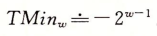
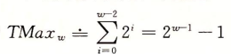
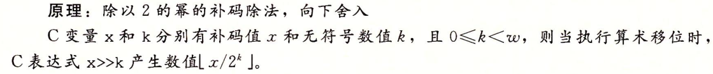

# 第2章：信息的表示和处理

* 无符号：传统二进制，表示大于或等于0的数
* 补码：有符号整数，正负均可
* 浮点数：实数的科学计数法，以2位基数

精度有限，浮点运算不可结合

## 2.1信息存储

### 2.1.1十六进制表示法

8位的字节作为**最小可寻址内存单位**

**虚拟内存：**非常大的字节数组

**地址：**每个字节由唯一数字标识

#### 十进制转十六进制

进行16整除，取余

#### 十六进制转十进制

#### 练习题2.4

注意：分清是操作数为十进制还是十六进制

### 2.1.2字数据大小

### 2.1.3寻址和字节顺序

例如：int变量x地址为0x100，则4个字节存储在内存0x100、0x101、0x102、0x103位置

小端法：最**低**有效字节在最前面

大端法：最**高**有效字节在最前面

**大多数intel兼容机小端法，IBM和Oracle大多数机器大端。**许多比较新的微处理器是双端法（可配置大端或小端）。实际上选择**特定操作系统**，字节顺序也就**固定**

字节顺序情况

1. 网络传输时，通过网络标准将大端和小端的两个机器数据进行转换
2. 反汇编代码，不同字节顺序也会影响阅读。
3. 不同机器进行show_bytes处理。除了字节顺序，其他得到的结果都是一致的

> 可以使用typedef命名数据类型。如`typedef int *int_ponter`  则`*int_ponter`代表了int类型

### 2.1.6布尔代数

### 2.1.7C语言中的位级运算

异或的实现

### 2.1.9移位运算

口诀：尖角指向哪，就往哪里移。

**加减法优先级比移位运算高。**当不确定的时候，加括号

## 2.2整数表示

### 2.2.1整数数据类型

负数范围比整数范围大1

### 2.2.2无符号数编码

**最大值**

### 2.2.3补码编码

转换加上或者减去即可

### 2.2.5C语言有符号数与无符号数

默认有符号，创建无符号常量，加上后缀U或u

显式强制类型换

隐式转换：当一种类型表达式被赋值给另一种类型

运算时，如果一个有符号另一个无符号，C语言隐式将有符号强转为无符号数（非负）

1.  为无符号后成2147483648
2. 并且负数值越接近零，转为无符号数越大

### 2.2.8有符号与无符号数的建议

## 2.3整数运算

### 2.3.1无符号加法

### 2.3.2补码加法

### 2.3.3补码的非

补码非：取反加1

### 2.3.4无符号乘法

### 2.3.5补码乘法

先进行无符号乘法取模，再转为补码

补码和无符号乘法取模截断后的位级表示都相同

### 2.3.6乘以常数

通过移位、加法和减法消除整数乘以常数的情况。

注意溢出情况。

两种形式计算位对乘积影响

### 2.3.7除以2的幂

偏量为(1<<k) - 1

**不能用除以2的幂表示除以任何常数K的除法**

## 2.4浮点数

### 2.4.2IEEE浮点表示

32位中，s、exp和frac分别为1、8、23

64位中，s、exp和frac分别为1、11、52

**三种不同情况**

**情况1：规格化数**

阶码：E=e-Bias

Bias=

指数取值范围：单精度-126~+127，双精度-1022~+10233

尾数：1+f（隐含的1开头）

**情况2：非规格化值**

1. 提供表示数值0的方法(M=f=0)
2. 表示非常接近0.0的数（逐渐溢出）

**情况3：特殊值**

无穷：f全0

NaN：f不为0

### 2.4.3数字示例

