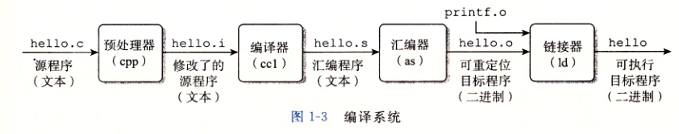
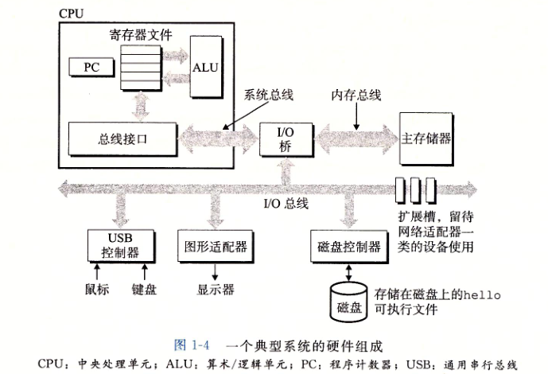

# 第一章、计算机系统漫游

## 1.2程序被其他程序翻译成不同的格式

* **预处理器、编译器、汇编器和连接器**构成**编译系统**

**预处理阶段**：#include<stdio.h>开头的原始C程序

**编译阶段**：包含一个汇编语言程序，如第三章的汇编代码

**汇编阶段**：翻译成机器语言指令，打包成 **可重定位目标程序**，保存在hello.o的**二进制文件**

**链接阶段**：调用了printf函数，在printf.o的单独预编译好的目标文件，通过**链接器**进行合并，成为**可执行文件**，可以**加载到内存**

## 1.4处理器读并解释村粗在内存中的指令

## 1.4.1系统的硬件组成

1. **总线**：**携带信息字节**并负责在**各个部件间进行传递**。字节块长度，成为字（word）
2. **I/O设备**：**系统与外部联系通道**。如鼠标、键盘、显示器、磁盘。I/O设备通过**控制器或适配器**与总线相连
   * 控制器：I/O设备本身或者主板上的芯片组
   * 适配器：插在主板插槽上的卡
3. 

